# Test Coverage Increase Plan: 50% → 80%

**Date:** 2025-11-23
**Current Coverage:** 50%
**Target Coverage:** 80%
**Gap to Close:** 30 percentage points

---

## Executive Summary

This plan outlines the strategy to increase test coverage from 50% to 80% by creating comprehensive unit tests for the currently untested services. The primary gaps are in:

1. **AISchedulerService** - 114 statements at 0% coverage
2. **ShadowAnalyzerService** - 16 statements in `analyze_shadow` at 0% coverage  
3. **FlowMemoryService** - `save_memory` (8 statements), `recall_memories` (8 statements) at 0% coverage

---

## Priority 1: AISchedulerService Tests

### File to Create: `backend/tests/unit/test_ai_scheduler.py`

**Service Location:** [`backend/app/services/ai_scheduler.py`](backend/app/services/ai_scheduler.py:31)

**Coverage Gap:** 114 statements (0% coverage)

### Test Classes Required

#### 1. TestPrioritizeTasks
Tests for [`AISchedulerService.prioritize_tasks()`](backend/app/services/ai_scheduler.py:44)

```python
class TestPrioritizeTasks:
    """Test task prioritization logic"""
    
    def test_prioritize_empty_list(self)
    def test_prioritize_single_task(self)
    def test_prioritize_multiple_tasks_by_deadline(self)
    def test_prioritize_overdue_task_highest_urgency(self)
    def test_prioritize_task_due_today(self)
    def test_prioritize_task_due_within_week(self)
    def test_prioritize_high_priority_over_low(self)
    def test_prioritize_with_parent_task_dependency(self)
    def test_prioritize_with_child_tasks(self)
    def test_prioritize_in_progress_momentum_boost(self)
    def test_prioritize_old_task_momentum_boost(self)
    def test_prioritize_project_linked_task_boost(self)
    def test_score_breakdown_calculated_correctly(self)
    def test_dependency_context_populated(self)
```

#### 2. TestSuggestSchedule
Tests for [`AISchedulerService.suggest_schedule()`](backend/app/services/ai_scheduler.py:170)

```python
class TestSuggestSchedule:
    """Test schedule suggestion logic"""
    
    def test_suggest_schedule_empty_tasks(self)
    def test_suggest_schedule_single_task(self)
    def test_suggest_schedule_multiple_tasks_same_day(self)
    def test_suggest_schedule_overflow_to_next_day(self)
    def test_suggest_schedule_high_priority_peak_hours(self)
    def test_suggest_schedule_custom_available_hours(self)
    def test_suggest_schedule_returns_total_days_required(self)
```

#### 3. TestGetFocusRecommendations
Tests for [`AISchedulerService.get_focus_recommendations()`](backend/app/services/ai_scheduler.py:242)

```python
class TestGetFocusRecommendations:
    """Test focus recommendation logic"""
    
    def test_recommendations_no_time_entries(self)
    def test_recommendations_with_time_entries(self)
    def test_recommendations_peak_productivity_hours(self)
    def test_recommendations_long_sessions_break_advice(self)
    def test_recommendations_low_tracking_consistency(self)
```

#### 4. TestDetectDistractions
Tests for [`AISchedulerService.detect_distractions()`](backend/app/services/ai_scheduler.py:337)

```python
class TestDetectDistractions:
    """Test distraction detection logic"""
    
    def test_detect_no_entries(self)
    def test_detect_short_sessions_warning(self)
    def test_detect_tracking_gaps_info(self)
    def test_custom_threshold_minutes(self)
```

#### 5. TestHelperMethods
Tests for helper methods

```python
class TestHelperMethods:
    """Test helper methods"""
    
    def test_get_urgency_level_critical(self)
    def test_get_urgency_level_high(self)
    def test_get_urgency_level_medium(self)
    def test_get_urgency_level_low(self)
    def test_get_recommendation_urgent(self)
    def test_get_recommendation_high(self)
    def test_get_recommendation_medium(self)
    def test_get_recommendation_low(self)
    def test_normalize_priority_string(self)
    def test_normalize_priority_integer(self)
    def test_normalize_priority_invalid(self)
```

---

## Priority 2: ShadowAnalyzerService Tests

### File to Create: `backend/tests/unit/test_shadow_analyzer.py`

**Service Location:** [`backend/app/services/shadow_analyzer.py`](backend/app/services/shadow_analyzer.py:64)

**Coverage Gap:** 16+ statements at 0% coverage

### Test Classes Required

#### 1. TestCreateProfile
Tests for profile creation

```python
class TestCreateProfile:
    """Test shadow profile creation"""
    
    def test_create_profile_new_user(self)
    def test_create_profile_existing_returns_existing(self)
    def test_create_profile_default_explorer_archetype(self)
```

#### 2. TestDetermineArchetype
Tests for [`_determine_archetype()`](backend/app/services/shadow_analyzer.py:99)

```python
class TestDetermineArchetype:
    """Test archetype determination logic"""
    
    def test_determine_archetype_no_tasks_returns_explorer(self)
    def test_determine_archetype_warrior_keywords(self)
    def test_determine_archetype_sage_keywords(self)
    def test_determine_archetype_creator_keywords(self)
    def test_determine_archetype_high_completion_rate_warrior_boost(self)
    def test_determine_archetype_long_descriptions_sage_boost(self)
```

#### 3. TestGetDailyInsight
Tests for [`get_daily_insight()`](backend/app/services/shadow_analyzer.py:233)

```python
class TestGetDailyInsight:
    """Test daily insight retrieval"""
    
    def test_get_insight_creates_profile_if_missing(self)
    def test_get_insight_locked_future_day(self)
    def test_get_insight_unlocked_current_day(self)
    def test_get_insight_invalid_day_number(self)
```

#### 4. TestUnlockNextDay
Tests for [`unlock_next_day()`](backend/app/services/shadow_analyzer.py:289)

```python
class TestUnlockNextDay:
    """Test day unlocking logic"""
    
    def test_unlock_no_profile_fails(self)
    def test_unlock_success(self)
    def test_unlock_all_days_already_unlocked(self)
```

#### 5. TestProgress
Tests for progress tracking

```python
class TestProgress:
    """Test progress tracking"""
    
    def test_get_progress_no_profile(self)
    def test_get_progress_with_profile(self)
    def test_get_all_unlocked_insights(self)
```

---

## Priority 3: FlowMemoryService Tests

### File to Create: `backend/tests/unit/test_flow_memory.py`

**Service Location:** [`backend/app/services/flow_memory.py`](backend/app/services/flow_memory.py:16)

**Coverage Gap:** 16+ statements at 0% coverage

### Test Classes Required

#### 1. TestStoreInteraction
Tests for [`store_interaction()`](backend/app/services/flow_memory.py:31)

```python
class TestStoreInteraction:
    """Test interaction storage"""
    
    async def test_store_first_interaction(self)
    async def test_store_adds_timestamp(self)
    async def test_store_with_session_id(self)
    async def test_store_truncates_old_interactions(self)
    async def test_store_extracts_patterns(self)
```

#### 2. TestRetrieveContext
Tests for [`retrieve_context()`](backend/app/services/flow_memory.py:86)

```python
class TestRetrieveContext:
    """Test context retrieval"""
    
    async def test_retrieve_empty_memory(self)
    async def test_retrieve_with_limit(self)
    async def test_retrieve_with_query_filter(self)
    async def test_retrieve_includes_compressed_context(self)
```

#### 3. TestExtractPatterns
Tests for [`_extract_patterns()`](backend/app/services/flow_memory.py:134)

```python
class TestExtractPatterns:
    """Test pattern extraction"""
    
    async def test_extract_empty_interactions(self)
    async def test_extract_topics(self)
    async def test_extract_intent_question(self)
    async def test_extract_intent_command(self)
    async def test_extract_time_patterns(self)
```

#### 4. TestSessionManagement
Tests for session operations

```python
class TestSessionManagement:
    """Test session management"""
    
    async def test_update_session(self)
    async def test_get_session(self)
    async def test_get_session_not_found(self)
```

#### 5. TestMemoryOperations
Tests for memory operations

```python
class TestMemoryOperations:
    """Test memory operations"""
    
    async def test_compress_and_store_context(self)
    async def test_clear_memory(self)
    async def test_get_memory_stats_no_data(self)
    async def test_get_memory_stats_with_data(self)
```

---

## Test Implementation Strategy

### Phase 1: Create Test Files (Week 1)

1. **Day 1-2:** Create `test_ai_scheduler.py` with all test classes
2. **Day 3-4:** Create `test_shadow_analyzer.py` with all test classes
3. **Day 5:** Create `test_flow_memory.py` with mock Redis fixtures

### Phase 2: Fix Fixtures and Run Tests (Week 2)

1. **Day 1-2:** Fix any fixture issues (mock Redis for flow memory)
2. **Day 3:** Run full test suite and verify coverage increase
3. **Day 4-5:** Update pytest.ini threshold incrementally

### Coverage Threshold Schedule

| Milestone | Threshold | Expected Date |
|-----------|-----------|---------------|
| Current   | 50%       | Now           |
| Phase 1   | 55%       | After AI Scheduler tests |
| Phase 2   | 60%       | After Shadow Analyzer tests |
| Phase 3   | 65%       | After Flow Memory tests |
| Phase 4   | 70%       | After additional router tests |
| Phase 5   | 80%       | Final milestone |

---

## Mock Requirements

### Redis Mock for FlowMemoryService

```python
@pytest.fixture
def mock_redis():
    """Mock Redis client for FlowMemoryService tests"""
    class MockRedis:
        def __init__(self):
            self.data = {}
        
        async def get(self, key):
            return self.data.get(key)
        
        async def setex(self, key, ttl, value):
            self.data[key] = value
        
        async def delete(self, key):
            self.data.pop(key, None)
        
        async def scan_iter(self, match=None):
            for key in list(self.data.keys()):
                if match and '*' in match:
                    pattern = match.replace('*', '')
                    if pattern in key:
                        yield key
    
    return MockRedis()
```

### Task Factory for AISchedulerService

```python
@pytest.fixture
def task_factory(db, test_user):
    """Factory to create test tasks"""
    def create_task(**kwargs):
        defaults = {
            "id": generate_id(),
            "userId": test_user.id,
            "title": "Test Task",
            "status": TaskStatus.PENDING,
            "priority": "medium",
            "createdAt": datetime.utcnow()
        }
        defaults.update(kwargs)
        task = Task(**defaults)
        db.add(task)
        db.commit()
        return task
    return create_task
```

---

## Verification Commands

```bash
# Run all new tests
cd backend
PYTHONPATH=. pytest tests/unit/test_ai_scheduler.py -v
PYTHONPATH=. pytest tests/unit/test_shadow_analyzer.py -v  
PYTHONPATH=. pytest tests/unit/test_flow_memory.py -v

# Check coverage
PYTHONPATH=. pytest --cov=app --cov-report=term-missing

# Generate HTML report
PYTHONPATH=. pytest --cov=app --cov-report=html
```

---

## Success Criteria

1. ✅ All new test files created and passing
2. ✅ Coverage increased from 50% to 80%
3. ✅ pytest.ini threshold updated to 80%
4. ✅ No regressions in existing tests
5. ✅ CI/CD pipeline passes with new threshold

---

## Files to Create

| File | Tests | Est. Coverage Impact |
|------|-------|---------------------|
| `backend/tests/unit/test_ai_scheduler.py` | 25+ tests | +10% |
| `backend/tests/unit/test_shadow_analyzer.py` | 15+ tests | +5% |
| `backend/tests/unit/test_flow_memory.py` | 15+ tests | +5% |
| Additional router tests | 20+ tests | +10% |

**Total Expected Impact:** +30% coverage (50% → 80%)

---

## Architecture Diagram

```mermaid
graph TD
    A[Test Coverage Plan] --> B[Priority 1: AISchedulerService]
    A --> C[Priority 2: ShadowAnalyzerService]
    A --> D[Priority 3: FlowMemoryService]
    
    B --> B1[test_ai_scheduler.py]
    B1 --> B2[TestPrioritizeTasks - 14 tests]
    B1 --> B3[TestSuggestSchedule - 7 tests]
    B1 --> B4[TestGetFocusRecommendations - 5 tests]
    B1 --> B5[TestDetectDistractions - 4 tests]
    B1 --> B6[TestHelperMethods - 11 tests]
    
    C --> C1[test_shadow_analyzer.py]
    C1 --> C2[TestCreateProfile - 3 tests]
    C1 --> C3[TestDetermineArchetype - 6 tests]
    C1 --> C4[TestGetDailyInsight - 4 tests]
    C1 --> C5[TestUnlockNextDay - 3 tests]
    C1 --> C6[TestProgress - 3 tests]
    
    D --> D1[test_flow_memory.py]
    D1 --> D2[TestStoreInteraction - 5 tests]
    D1 --> D3[TestRetrieveContext - 4 tests]
    D1 --> D4[TestExtractPatterns - 5 tests]
    D1 --> D5[TestSessionManagement - 3 tests]
    D1 --> D6[TestMemoryOperations - 4 tests]
```



---

**Document Status:** Ready for Implementation
**Next Step:** Switch to Code mode to create test files