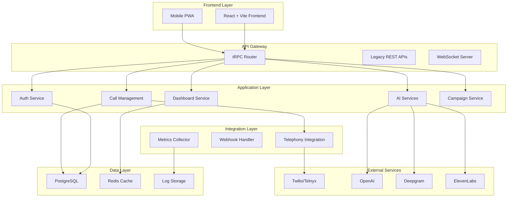
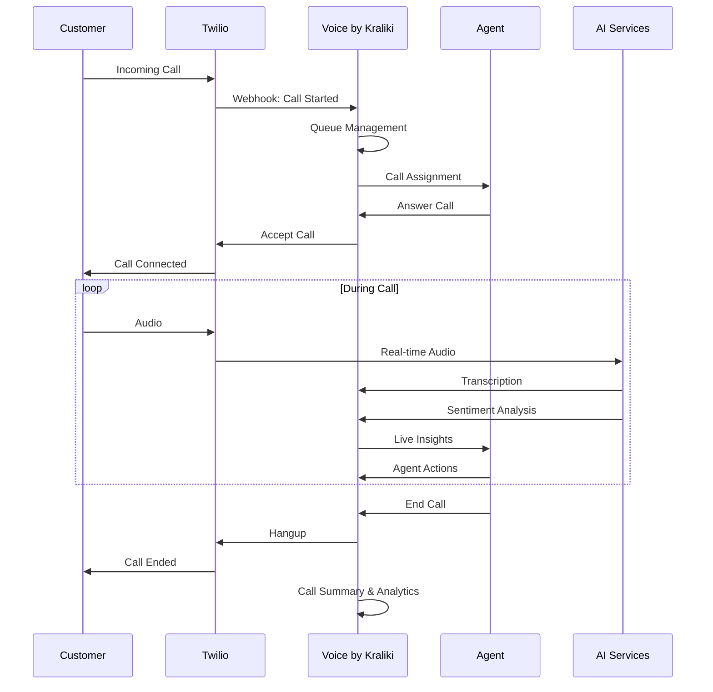
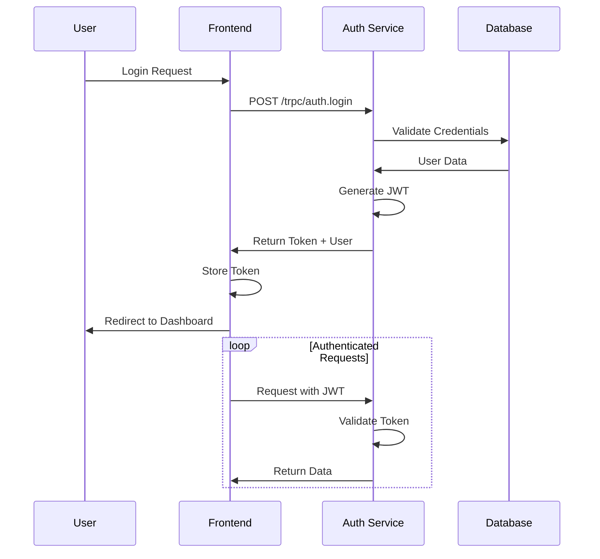
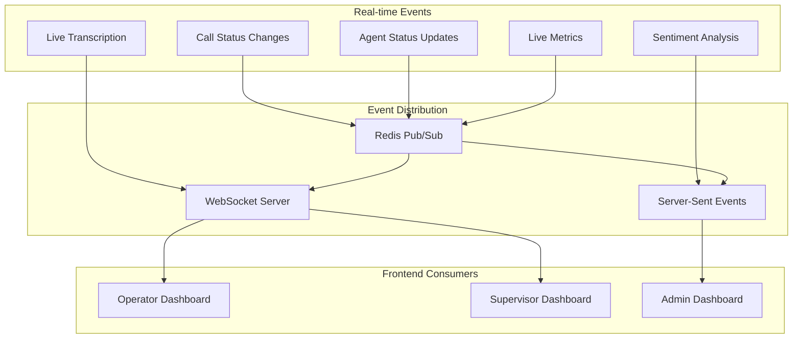
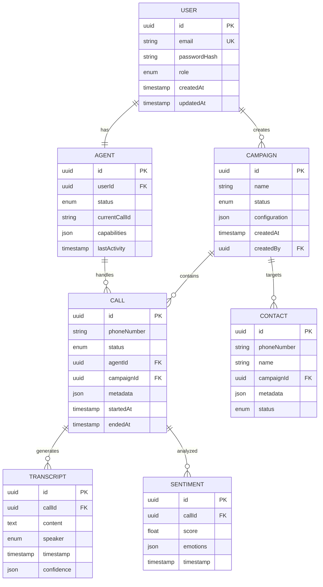
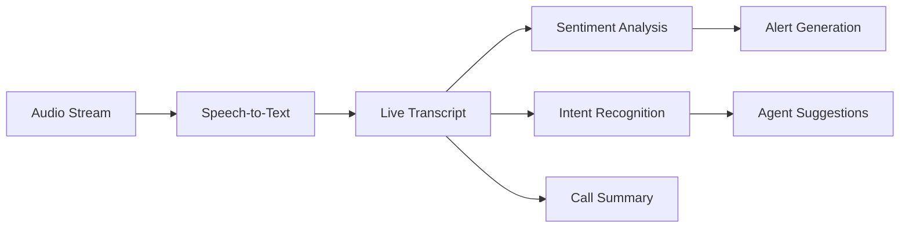

# Voice by Kraliki System Architecture

> **Comprehensive System Design and Data Flow Documentation**

## Table of Contents

1. [Overview](#overview)
2. [High-Level Architecture](#high-level-architecture)
3. [Technology Stack](#technology-stack)
4. [Component Architecture](#component-architecture)
5. [Data Flow](#data-flow)
6. [Database Design](#database-design)
7. [API Architecture](#api-architecture)
8. [Real-time Communication](#real-time-communication)
9. [AI Integration](#ai-integration)
10. [Security Architecture](#security-architecture)
11. [Deployment Architecture](#deployment-architecture)
12. [Scalability Considerations](#scalability-considerations)

## Overview

Voice by Kraliki is a modern, AI-powered call center platform built with a microservices-inspired architecture using Stack 2025 standards. The system emphasizes:

- **Type Safety**: Full TypeScript implementation
- **Real-time Operations**: WebSocket and SSE integration
- **AI-First Design**: Integrated AI services for all operations
- **Scalable Architecture**: Modular design for horizontal scaling
- **Production Ready**: Comprehensive monitoring and observability

## High-Level Architecture



## Technology Stack

### Frontend Stack
```typescript
// Core Framework
React 18 + TypeScript
Vite (Build Tool)
React Router (Navigation)

// UI Framework
NextUI + Tailwind CSS
Framer Motion (Animations)
React Query (State Management)

// Development
ESLint + Prettier
Playwright (Testing)
```

### Backend Stack
```typescript
// Core Framework
Fastify + TypeScript
tRPC (API Layer)
Prisma (ORM)

// Database & Cache
PostgreSQL (Primary Database)
Redis (Caching & Sessions)

// AI & External Services
OpenAI GPT-4 (AI Processing)
Deepgram (Speech-to-Text)
ElevenLabs (Text-to-Speech)
Twilio/Telnyx (Telephony)
```

### Infrastructure
```yaml
# Container Platform
Docker + Docker Compose
PM2 (Process Management)

# Monitoring
Winston (Logging)
Prometheus (Metrics)
Grafana (Visualization)

# Security
JWT (Authentication)
HTTPS/TLS (Encryption)
Rate Limiting
```

## Component Architecture

### 1. Frontend Architecture

```typescript
src/
├── components/          # Reusable UI components
│   ├── dashboard/      # Dashboard-specific components
│   ├── agent/         # Agent interface components
│   ├── supervisor/    # Supervisor tools
│   └── common/        # Shared components
├── contexts/           # React contexts
│   ├── AuthContext.tsx
│   ├── CallContext.tsx
│   └── DashboardContext.tsx
├── services/          # Frontend services
│   ├── trpc.ts       # tRPC client configuration
│   ├── websocket.ts  # WebSocket client
│   └── storage.ts    # Local storage management
├── pages/             # Route components
│   ├── operator/     # Operator dashboard
│   ├── supervisor/   # Supervisor dashboard
│   └── admin/        # Admin interface
└── utils/             # Utility functions
```

### 2. Backend Architecture

```typescript
server/
├── trpc/              # tRPC API layer
│   ├── context.ts     # Request context
│   ├── router.ts      # Root router
│   └── routers/       # Individual route modules
├── services/          # Business logic services
│   ├── CallService.ts
│   ├── AgentService.ts
│   ├── AIService.ts
│   └── DashboardService.ts
├── core/              # Core integrations
│   ├── telephony/     # Telephony providers
│   ├── ai/           # AI service integrations
│   └── websocket/    # Real-time communication
├── middleware/        # Express/Fastify middleware
│   ├── auth.ts       # Authentication
│   ├── rateLimit.ts  # Rate limiting
│   └── logging.ts    # Request logging
└── utils/             # Server utilities
```

## Data Flow

### 1. Call Flow Architecture



### 2. Authentication Flow



### 3. Real-time Data Flow



## Database Design

### Entity Relationship Diagram



### Database Schema

```sql
-- Core user management
CREATE TABLE users (
    id UUID PRIMARY KEY DEFAULT gen_random_uuid(),
    email VARCHAR(255) UNIQUE NOT NULL,
    password_hash VARCHAR(255) NOT NULL,
    role user_role NOT NULL DEFAULT 'AGENT',
    created_at TIMESTAMP DEFAULT NOW(),
    updated_at TIMESTAMP DEFAULT NOW()
);

-- Agent management
CREATE TABLE agents (
    id UUID PRIMARY KEY DEFAULT gen_random_uuid(),
    user_id UUID REFERENCES users(id) ON DELETE CASCADE,
    status agent_status DEFAULT 'OFFLINE',
    current_call_id UUID,
    capabilities JSONB DEFAULT '{}',
    last_activity TIMESTAMP DEFAULT NOW()
);

-- Call management
CREATE TABLE calls (
    id UUID PRIMARY KEY DEFAULT gen_random_uuid(),
    phone_number VARCHAR(20) NOT NULL,
    status call_status DEFAULT 'QUEUED',
    agent_id UUID REFERENCES agents(id),
    campaign_id UUID REFERENCES campaigns(id),
    external_id VARCHAR(255), -- Twilio Call SID
    metadata JSONB DEFAULT '{}',
    started_at TIMESTAMP DEFAULT NOW(),
    ended_at TIMESTAMP,
    duration INTEGER -- seconds
);

-- AI transcription
CREATE TABLE transcripts (
    id UUID PRIMARY KEY DEFAULT gen_random_uuid(),
    call_id UUID REFERENCES calls(id) ON DELETE CASCADE,
    content TEXT NOT NULL,
    speaker transcript_speaker NOT NULL,
    timestamp TIMESTAMP DEFAULT NOW(),
    confidence JSONB -- transcription confidence scores
);

-- Sentiment analysis
CREATE TABLE sentiment_analysis (
    id UUID PRIMARY KEY DEFAULT gen_random_uuid(),
    call_id UUID REFERENCES calls(id) ON DELETE CASCADE,
    score FLOAT NOT NULL, -- -1.0 to 1.0
    emotions JSONB, -- detected emotions with scores
    timestamp TIMESTAMP DEFAULT NOW()
);
```

## API Architecture

### tRPC Router Structure

```typescript
// Root router combining all sub-routers
export const appRouter = router({
  // Core operations
  auth: authRouter,
  call: callRouter,
  agent: agentRouter,

  // AI services
  ai: aiRouter,
  sentiment: sentimentRouter,
  agentAssist: agentAssistRouter,

  // Management
  campaign: campaignRouter,
  contact: contactRouter,
  team: teamRouter,
  supervisor: supervisorRouter,

  // Integration
  telephony: telephonyRouter,
  twilioWebhooks: twilioWebhooksRouter,
  webhooks: webhooksRouter,

  // Monitoring
  dashboard: dashboardRouter,
  analytics: analyticsRouter,
  metrics: metricsRouter,
  apm: apmRouter,
  circuitBreaker: circuitBreakerRouter,
  aiHealth: aiHealthRouter,

  // System
  ivr: ivrRouter,
  payments: paymentsRouter,
  callByok: callByokRouter
});

export type AppRouter = typeof appRouter;
```

### Request/Response Flow

```typescript
// 1. Client Request
const call = await trpc.call.create.mutate({
  phoneNumber: '+1234567890',
  campaignId: 'campaign-123'
});

// 2. tRPC Processing
// - Input validation with Zod
// - Authentication check
// - Authorization verification
// - Business logic execution
// - Response serialization

// 3. Service Layer
class CallService {
  async createCall(input: CreateCallInput): Promise<Call> {
    // Validate phone number
    // Check campaign permissions
    // Create call record
    // Initiate telephony provider call
    // Return call object
  }
}

// 4. Database Layer
await prisma.call.create({
  data: {
    phoneNumber: input.phoneNumber,
    campaignId: input.campaignId,
    status: 'QUEUED',
    metadata: input.metadata
  }
});
```

## Real-time Communication

### WebSocket Architecture

```typescript
// WebSocket event types
interface WebSocketEvents {
  'call:status': { callId: string; status: CallStatus };
  'agent:status': { agentId: string; status: AgentStatus };
  'transcript:update': { callId: string; text: string; speaker: string };
  'sentiment:update': { callId: string; score: number; emotions: object };
  'dashboard:metrics': { timestamp: number; metrics: DashboardMetrics };
}

// Server-side WebSocket handler
class WebSocketHandler {
  constructor(private io: SocketIO.Server) {
    this.setupEventHandlers();
  }

  private setupEventHandlers() {
    this.io.on('connection', (socket) => {
      // Join role-based rooms
      socket.join(`role:${socket.user.role}`);

      // Handle call status updates
      socket.on('call:status:update', (data) => {
        this.io.to(`call:${data.callId}`).emit('call:status', data);
      });
    });
  }
}
```

### Server-Sent Events

```typescript
// SSE for real-time dashboard updates
export class DashboardSSE {
  private clients = new Map<string, Response>();

  addClient(userId: string, response: Response) {
    this.clients.set(userId, response);
  }

  broadcastMetrics(metrics: DashboardMetrics) {
    this.clients.forEach((response, userId) => {
      response.write(`data: ${JSON.stringify(metrics)}\n\n`);
    });
  }
}
```

## AI Integration

### AI Service Architecture

```typescript
interface AIService {
  transcribe(audio: AudioData): Promise<TranscriptionResult>;
  analyze(text: string): Promise<AnalysisResult>;
  generateResponse(context: CallContext): Promise<string>;
}

class OpenAIService implements AIService {
  async transcribe(audio: AudioData) {
    return await this.openai.audio.transcriptions.create({
      file: audio,
      model: 'whisper-1',
      language: 'en'
    });
  }

  async analyze(text: string) {
    return await this.openai.chat.completions.create({
      model: 'gpt-4',
      messages: [
        {
          role: 'system',
          content: 'Analyze this customer service conversation...'
        },
        { role: 'user', content: text }
      ]
    });
  }
}
```

### AI Pipeline



## Security Architecture

### Authentication & Authorization

```typescript
// JWT-based authentication
interface JWTPayload {
  userId: string;
  role: UserRole;
  permissions: string[];
  exp: number;
}

// Role-based access control
const rolePermissions = {
  AGENT: ['call:read', 'call:update', 'agent:update:own'],
  SUPERVISOR: ['call:*', 'agent:*', 'team:read'],
  ADMIN: ['*']
};

// Middleware for authorization
const authorize = (permissions: string[]) => {
  return (req: Request, res: Response, next: NextFunction) => {
    const userPermissions = req.user.permissions;
    const hasPermission = permissions.some(p =>
      userPermissions.includes(p) || userPermissions.includes('*')
    );

    if (!hasPermission) {
      return res.status(403).json({ error: 'Insufficient permissions' });
    }

    next();
  };
};
```

### Data Security

```typescript
// Encryption for sensitive data
class DataEncryption {
  private static key = process.env.ENCRYPTION_KEY;

  static encrypt(data: string): string {
    const cipher = crypto.createCipher('aes-256-cbc', this.key);
    return cipher.update(data, 'utf8', 'hex') + cipher.final('hex');
  }

  static decrypt(encrypted: string): string {
    const decipher = crypto.createDecipher('aes-256-cbc', this.key);
    return decipher.update(encrypted, 'hex', 'utf8') + decipher.final('utf8');
  }
}

// Secure storage for call recordings
class SecureStorage {
  async storeRecording(callId: string, audioData: Buffer) {
    const encryptedData = DataEncryption.encrypt(audioData.toString('base64'));
    await this.s3.upload({
      Bucket: 'call-recordings',
      Key: `${callId}.enc`,
      Body: encryptedData,
      ServerSideEncryption: 'AES256'
    }).promise();
  }
}
```

## Deployment Architecture

### Container Architecture

```dockerfile
# Multi-stage Dockerfile
FROM node:18-alpine AS builder
WORKDIR /app
COPY package*.json ./
RUN pnpm install --frozen-lockfile
COPY . .
RUN pnpm build

FROM node:18-alpine AS runtime
WORKDIR /app
COPY --from=builder /app/dist ./dist
COPY --from=builder /app/node_modules ./node_modules
COPY ecosystem.config.js ./
EXPOSE 3010
CMD ["pnpm", "pm2-runtime", "start", "ecosystem.config.js"]
```

### Docker Compose Stack

```yaml
version: '3.8'
services:
  app:
    build: .
    ports:
      - "3010:3010"
    environment:
      - NODE_ENV=production
      - DATABASE_URL=${DATABASE_URL}
    depends_on:
      - postgres
      - redis
    healthcheck:
      test: ["CMD", "curl", "-f", "http://localhost:3010/health"]
      interval: 30s
      timeout: 10s
      retries: 3

  postgres:
    image: postgres:15-alpine
    environment:
      - POSTGRES_DB=cc_lite
      - POSTGRES_USER=${DB_USER}
      - POSTGRES_PASSWORD=${DB_PASSWORD}
    volumes:
      - postgres_data:/var/lib/postgresql/data
    ports:
      - "5432:5432"

  redis:
    image: redis:7-alpine
    ports:
      - "6379:6379"
    volumes:
      - redis_data:/data

  nginx:
    image: nginx:alpine
    ports:
      - "80:80"
      - "443:443"
    volumes:
      - ./nginx.conf:/etc/nginx/nginx.conf
      - ./ssl:/etc/ssl
    depends_on:
      - app
```

## Scalability Considerations

### Horizontal Scaling

```typescript
// Load balancer configuration
upstream cc_lite_backend {
    server app1:3010 weight=1;
    server app2:3010 weight=1;
    server app3:3010 weight=1;
}

// Session affinity for WebSocket connections
map $http_upgrade $connection_upgrade {
    default upgrade;
    '' close;
}

// Sticky sessions for real-time features
location /socket.io/ {
    proxy_pass http://cc_lite_backend;
    proxy_http_version 1.1;
    proxy_set_header Upgrade $http_upgrade;
    proxy_set_header Connection $connection_upgrade;
    proxy_set_header Host $host;
    ip_hash; # Sticky sessions
}
```

### Database Scaling

```typescript
// Read replica configuration
const prisma = new PrismaClient({
  datasources: {
    db: {
      url: process.env.DATABASE_URL // Primary
    }
  }
});

const prismaRead = new PrismaClient({
  datasources: {
    db: {
      url: process.env.DATABASE_READ_URL // Read replica
    }
  }
});

// Service layer with read/write splitting
class CallService {
  async getCalls(filters: CallFilters) {
    // Use read replica for queries
    return await prismaRead.call.findMany({
      where: filters
    });
  }

  async createCall(data: CreateCallInput) {
    // Use primary for writes
    return await prisma.call.create({ data });
  }
}
```

### Caching Strategy

```typescript
// Multi-level caching
class CacheService {
  constructor(
    private redis: RedisClient,
    private memoryCache: NodeCache
  ) {}

  async get<T>(key: string): Promise<T | null> {
    // L1: Memory cache (fastest)
    let value = this.memoryCache.get<T>(key);
    if (value) return value;

    // L2: Redis cache (fast)
    const redisValue = await this.redis.get(key);
    if (redisValue) {
      value = JSON.parse(redisValue);
      this.memoryCache.set(key, value, 300); // 5 min TTL
      return value;
    }

    return null;
  }

  async set<T>(key: string, value: T, ttl = 3600): Promise<void> {
    // Store in both levels
    this.memoryCache.set(key, value, ttl);
    await this.redis.setex(key, ttl, JSON.stringify(value));
  }
}
```

## Performance Optimization

### Query Optimization

```typescript
// Optimized queries with proper indexing
await prisma.call.findMany({
  where: {
    agentId: agentId,
    status: 'ACTIVE',
    createdAt: {
      gte: startDate
    }
  },
  include: {
    agent: {
      select: { id: true, user: { select: { email: true } } }
    },
    transcripts: {
      orderBy: { timestamp: 'desc' },
      take: 10
    }
  },
  orderBy: { createdAt: 'desc' }
});

// Database indexes for performance
CREATE INDEX idx_calls_agent_status ON calls(agent_id, status);
CREATE INDEX idx_calls_created_at ON calls(created_at);
CREATE INDEX idx_transcripts_call_timestamp ON transcripts(call_id, timestamp);
```

### Memory Management

```typescript
// Efficient memory usage for real-time features
class TranscriptBuffer {
  private buffers = new Map<string, CircularBuffer>();
  private readonly MAX_BUFFER_SIZE = 1000;

  addTranscript(callId: string, transcript: Transcript) {
    if (!this.buffers.has(callId)) {
      this.buffers.set(callId, new CircularBuffer(this.MAX_BUFFER_SIZE));
    }

    const buffer = this.buffers.get(callId)!;
    buffer.add(transcript);

    // Cleanup completed calls
    if (transcript.isCallEnd) {
      this.buffers.delete(callId);
    }
  }
}
```

This architecture ensures Voice by Kraliki can scale from small call centers to enterprise deployments while maintaining performance, security, and reliability standards.