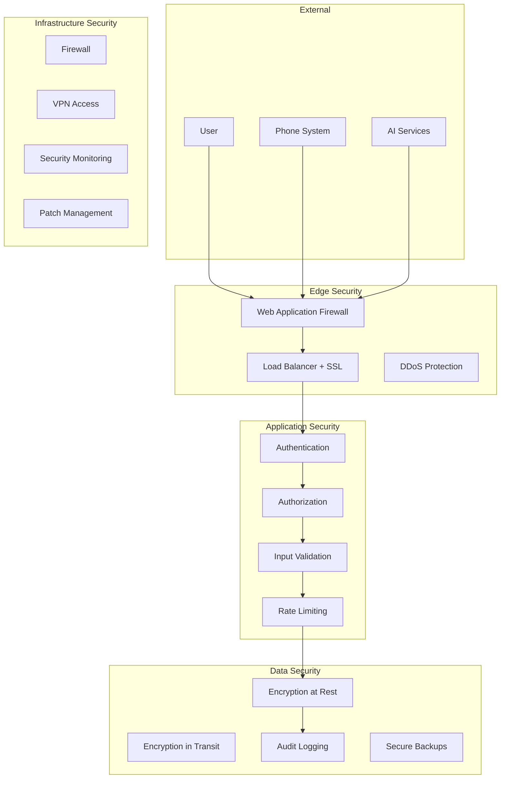

# Voice by Kraliki Security Documentation

> **Comprehensive Security Best Practices and Compliance Guide**

## Table of Contents

1. [Security Overview](#security-overview)
2. [Authentication & Authorization](#authentication--authorization)
3. [Data Protection](#data-protection)
4. [Network Security](#network-security)
5. [API Security](#api-security)
6. [Database Security](#database-security)
7. [Frontend Security](#frontend-security)
8. [Infrastructure Security](#infrastructure-security)
9. [Compliance Requirements](#compliance-requirements)
10. [Security Monitoring](#security-monitoring)
11. [Incident Response](#incident-response)
12. [Security Checklist](#security-checklist)

## Security Overview

Voice by Kraliki implements a comprehensive security framework addressing:

- **Zero Trust Architecture** - Never trust, always verify
- **Defense in Depth** - Multiple security layers
- **Principle of Least Privilege** - Minimal required access
- **Data Privacy by Design** - Privacy considerations from inception
- **Continuous Monitoring** - Real-time threat detection

### Security Architecture



## Authentication & Authorization

### JWT-Based Authentication

```typescript
// JWT Configuration
interface JWTConfig {
  algorithm: 'ES256'; // Elliptic Curve Digital Signature Algorithm
  expiresIn: '1h';    // Short-lived tokens
  refreshExpiresIn: '7d'; // Refresh token validity
  issuer: 'cc-lite';
  audience: 'cc-lite-users';
}

// Token Generation
export class AuthService {
  private readonly privateKey: string;
  private readonly publicKey: string;

  constructor() {
    this.privateKey = process.env.JWT_PRIVATE_KEY!;
    this.publicKey = process.env.JWT_PUBLIC_KEY!;
  }

  async generateTokens(user: User): Promise<TokenPair> {
    const payload = {
      sub: user.id,
      email: user.email,
      role: user.role,
      permissions: this.getUserPermissions(user.role),
      iat: Math.floor(Date.now() / 1000),
      iss: 'cc-lite',
      aud: 'cc-lite-users'
    };

    const accessToken = jwt.sign(payload, this.privateKey, {
      algorithm: 'ES256',
      expiresIn: '1h'
    });

    const refreshToken = jwt.sign(
      { sub: user.id, type: 'refresh' },
      this.privateKey,
      { algorithm: 'ES256', expiresIn: '7d' }
    );

    // Store refresh token hash in database
    await this.storeRefreshToken(user.id, refreshToken);

    return { accessToken, refreshToken };
  }

  async verifyToken(token: string): Promise<JWTPayload> {
    try {
      const payload = jwt.verify(token, this.publicKey, {
        algorithms: ['ES256'],
        issuer: 'cc-lite',
        audience: 'cc-lite-users'
      }) as JWTPayload;

      // Additional security checks
      await this.validateTokenClaims(payload);

      return payload;
    } catch (error) {
      throw new UnauthorizedError('Invalid token');
    }
  }
}
```

### Role-Based Access Control (RBAC)

```typescript
// Permission definitions
enum Permission {
  // Call management
  CALL_READ = 'call:read',
  CALL_CREATE = 'call:create',
  CALL_UPDATE = 'call:update',
  CALL_DELETE = 'call:delete',

  // Agent management
  AGENT_READ = 'agent:read',
  AGENT_UPDATE_OWN = 'agent:update:own',
  AGENT_UPDATE_ALL = 'agent:update:all',

  // Supervisor functions
  TEAM_READ = 'team:read',
  TEAM_MANAGE = 'team:manage',
  CALL_MONITOR = 'call:monitor',
  CALL_BARGE = 'call:barge',

  // Admin functions
  USER_MANAGE = 'user:manage',
  SYSTEM_CONFIG = 'system:config',
  AUDIT_READ = 'audit:read'
}

// Role definitions
const rolePermissions: Record<UserRole, Permission[]> = {
  AGENT: [
    Permission.CALL_READ,
    Permission.CALL_CREATE,
    Permission.CALL_UPDATE,
    Permission.AGENT_UPDATE_OWN
  ],

  SUPERVISOR: [
    Permission.CALL_READ,
    Permission.CALL_CREATE,
    Permission.CALL_UPDATE,
    Permission.CALL_MONITOR,
    Permission.CALL_BARGE,
    Permission.AGENT_READ,
    Permission.TEAM_READ,
    Permission.TEAM_MANAGE
  ],

  ADMIN: Object.values(Permission) // All permissions
};

// Authorization middleware
export const authorize = (requiredPermissions: Permission[]) => {
  return async (req: Request, res: Response, next: NextFunction) => {
    const user = req.user;
    if (!user) {
      return res.status(401).json({ error: 'Authentication required' });
    }

    const userPermissions = rolePermissions[user.role];
    const hasPermission = requiredPermissions.every(permission =>
      userPermissions.includes(permission)
    );

    if (!hasPermission) {
      return res.status(403).json({ error: 'Insufficient permissions' });
    }

    next();
  };
};
```

### Secure Session Management

```typescript
// Session configuration
interface SessionConfig {
  name: 'cc-lite-session';
  secret: string; // 256-bit random secret
  resave: false;
  saveUninitialized: false;
  rolling: true; // Reset expiration on activity
  cookie: {
    secure: true;      // HTTPS only
    httpOnly: true;    // No JavaScript access
    maxAge: 3600000;   // 1 hour
    sameSite: 'strict'; // CSRF protection
  };
}

// Session store with Redis
export class SecureSessionStore {
  private redis: Redis;

  constructor() {
    this.redis = new Redis({
      host: process.env.REDIS_HOST,
      port: parseInt(process.env.REDIS_PORT!),
      password: process.env.REDIS_PASSWORD,
      tls: process.env.NODE_ENV === 'production' ? {} : undefined
    });
  }

  async set(sessionId: string, session: SessionData): Promise<void> {
    const encrypted = this.encrypt(JSON.stringify(session));
    await this.redis.setex(
      `session:${sessionId}`,
      3600, // 1 hour TTL
      encrypted
    );
  }

  async get(sessionId: string): Promise<SessionData | null> {
    const encrypted = await this.redis.get(`session:${sessionId}`);
    if (!encrypted) return null;

    const decrypted = this.decrypt(encrypted);
    return JSON.parse(decrypted);
  }

  private encrypt(data: string): string {
    const cipher = crypto.createCipher('aes-256-gcm', process.env.SESSION_SECRET!);
    return cipher.update(data, 'utf8', 'hex') + cipher.final('hex');
  }

  private decrypt(encrypted: string): string {
    const decipher = crypto.createDecipher('aes-256-gcm', process.env.SESSION_SECRET!);
    return decipher.update(encrypted, 'hex', 'utf8') + decipher.final('utf8');
  }
}
```

## Data Protection

### Encryption at Rest

```typescript
// Data encryption service
export class DataEncryptionService {
  private readonly key: Buffer;
  private readonly algorithm = 'aes-256-gcm';

  constructor() {
    this.key = Buffer.from(process.env.ENCRYPTION_KEY!, 'hex');
  }

  encrypt(data: string): EncryptedData {
    const iv = crypto.randomBytes(16);
    const cipher = crypto.createCipher(this.algorithm, this.key);
    cipher.setAAD(Buffer.from('cc-lite')); // Additional authenticated data

    let encrypted = cipher.update(data, 'utf8', 'hex');
    encrypted += cipher.final('hex');

    const authTag = cipher.getAuthTag();

    return {
      data: encrypted,
      iv: iv.toString('hex'),
      authTag: authTag.toString('hex')
    };
  }

  decrypt(encryptedData: EncryptedData): string {
    const decipher = crypto.createDecipher(this.algorithm, this.key);
    decipher.setAAD(Buffer.from('cc-lite'));
    decipher.setAuthTag(Buffer.from(encryptedData.authTag, 'hex'));

    let decrypted = decipher.update(encryptedData.data, 'hex', 'utf8');
    decrypted += decipher.final('utf8');

    return decrypted;
  }
}

// Database field encryption
export class EncryptedField {
  constructor(private encryptionService: DataEncryptionService) {}

  // Prisma middleware for automatic encryption
  static middleware(prisma: PrismaClient, encryptionService: DataEncryptionService) {
    prisma.$use(async (params, next) => {
      const encryptedFields = ['phoneNumber', 'email', 'notes'];

      // Encrypt on write
      if (params.action === 'create' || params.action === 'update') {
        for (const field of encryptedFields) {
          if (params.args.data[field]) {
            params.args.data[field] = encryptionService.encrypt(
              params.args.data[field]
            );
          }
        }
      }

      const result = await next(params);

      // Decrypt on read
      if (params.action === 'findMany' || params.action === 'findFirst') {
        if (Array.isArray(result)) {
          result.forEach(record => this.decryptRecord(record, encryptedFields));
        } else if (result) {
          this.decryptRecord(result, encryptedFields);
        }
      }

      return result;
    });
  }

  private static decryptRecord(record: any, fields: string[]) {
    for (const field of fields) {
      if (record[field] && typeof record[field] === 'object') {
        record[field] = this.encryptionService.decrypt(record[field]);
      }
    }
  }
}
```

### Personally Identifiable Information (PII) Protection

```typescript
// PII detection and redaction
export class PIIProtectionService {
  private readonly piiPatterns = {
    email: /\b[A-Za-z0-9._%+-]+@[A-Za-z0-9.-]+\.[A-Z|a-z]{2,}\b/g,
    phone: /\b\d{3}-\d{3}-\d{4}\b|\b\(\d{3}\)\s*\d{3}-\d{4}\b/g,
    ssn: /\b\d{3}-\d{2}-\d{4}\b/g,
    creditCard: /\b\d{4}[\s-]?\d{4}[\s-]?\d{4}[\s-]?\d{4}\b/g
  };

  detectPII(text: string): PIIDetection[] {
    const detections: PIIDetection[] = [];

    for (const [type, pattern] of Object.entries(this.piiPatterns)) {
      const matches = Array.from(text.matchAll(pattern));
      for (const match of matches) {
        detections.push({
          type: type as PIIType,
          value: match[0],
          start: match.index!,
          end: match.index! + match[0].length
        });
      }
    }

    return detections;
  }

  redactPII(text: string, preserveFormat = true): string {
    let redacted = text;

    for (const [type, pattern] of Object.entries(this.piiPatterns)) {
      redacted = redacted.replace(pattern, (match) => {
        if (preserveFormat) {
          return this.preserveFormatRedaction(match, type);
        } else {
          return `[REDACTED-${type.toUpperCase()}]`;
        }
      });
    }

    return redacted;
  }

  private preserveFormatRedaction(value: string, type: string): string {
    switch (type) {
      case 'phone':
        return value.replace(/\d/g, '*');
      case 'email':
        const [local, domain] = value.split('@');
        return `${local.charAt(0)}***@${domain}`;
      case 'creditCard':
        return value.replace(/\d(?=\d{4})/g, '*');
      default:
        return '*'.repeat(value.length);
    }
  }
}
```

### Secure Call Recording

```typescript
// Secure call recording with encryption
export class SecureCallRecordingService {
  constructor(
    private encryptionService: DataEncryptionService,
    private storageService: StorageService,
    private auditService: AuditService
  ) {}

  async startRecording(callId: string, consentGiven: boolean): Promise<Recording> {
    if (!consentGiven) {
      throw new Error('Recording consent required');
    }

    // Audit recording start
    await this.auditService.log({
      action: 'RECORDING_STARTED',
      resource: 'call',
      resourceId: callId,
      metadata: { consentGiven }
    });

    return await this.recordingRepository.create({
      callId,
      status: 'RECORDING',
      consentGiven,
      startedAt: new Date()
    });
  }

  async stopRecording(recordingId: string, audioData: Buffer): Promise<void> {
    // Encrypt audio data
    const encryptedAudio = this.encryptionService.encrypt(
      audioData.toString('base64')
    );

    // Store encrypted recording
    const storageKey = `recordings/${recordingId}.enc`;
    await this.storageService.store(storageKey, encryptedAudio);

    // Update recording record
    await this.recordingRepository.update(recordingId, {
      status: 'COMPLETED',
      storageKey,
      endedAt: new Date()
    });

    // Audit recording completion
    await this.auditService.log({
      action: 'RECORDING_COMPLETED',
      resource: 'recording',
      resourceId: recordingId,
      metadata: { storageKey }
    });
  }

  async getRecording(recordingId: string, userId: string): Promise<Buffer> {
    // Check authorization
    await this.checkRecordingAccess(recordingId, userId);

    const recording = await this.recordingRepository.findById(recordingId);
    if (!recording) {
      throw new NotFoundError('Recording not found');
    }

    // Retrieve and decrypt
    const encryptedData = await this.storageService.retrieve(recording.storageKey);
    const decryptedData = this.encryptionService.decrypt(encryptedData);

    // Audit access
    await this.auditService.log({
      action: 'RECORDING_ACCESSED',
      resource: 'recording',
      resourceId: recordingId,
      userId
    });

    return Buffer.from(decryptedData, 'base64');
  }
}
```

## Network Security

### TLS/SSL Configuration

```nginx
# Nginx SSL configuration
server {
    listen 443 ssl http2;
    server_name cc-lite.example.com;

    # SSL certificates
    ssl_certificate /etc/ssl/certs/cc-lite.crt;
    ssl_certificate_key /etc/ssl/private/cc-lite.key;

    # SSL protocols and ciphers
    ssl_protocols TLSv1.2 TLSv1.3;
    ssl_ciphers ECDHE-RSA-AES256-GCM-SHA512:DHE-RSA-AES256-GCM-SHA512:ECDHE-RSA-AES256-GCM-SHA384;
    ssl_prefer_server_ciphers off;

    # SSL security headers
    ssl_session_cache shared:SSL:10m;
    ssl_session_timeout 10m;
    ssl_stapling on;
    ssl_stapling_verify on;

    # Security headers
    add_header Strict-Transport-Security "max-age=31536000; includeSubDomains; preload" always;
    add_header X-Frame-Options DENY always;
    add_header X-Content-Type-Options nosniff always;
    add_header X-XSS-Protection "1; mode=block" always;
    add_header Referrer-Policy "strict-origin-when-cross-origin" always;
    add_header Content-Security-Policy "default-src 'self'; script-src 'self' 'unsafe-inline'; style-src 'self' 'unsafe-inline'; img-src 'self' data: https:; connect-src 'self' wss:; font-src 'self'; object-src 'none'; media-src 'self'; frame-src 'none';" always;

    # OCSP stapling
    resolver 8.8.8.8 8.8.4.4 valid=300s;
    resolver_timeout 5s;
}
```

### Firewall Configuration

```bash
#!/bin/bash
# UFW firewall configuration for Voice by Kraliki

# Reset firewall rules
ufw --force reset

# Default policies
ufw default deny incoming
ufw default allow outgoing

# SSH access (limit rate)
ufw limit ssh

# HTTP/HTTPS
ufw allow 80/tcp
ufw allow 443/tcp

# Application ports (restrict to specific IPs)
ufw allow from 10.0.0.0/8 to any port 3010 # API
ufw allow from 10.0.0.0/8 to any port 5432 # PostgreSQL
ufw allow from 10.0.0.0/8 to any port 6379 # Redis

# Monitoring
ufw allow from 10.0.0.0/8 to any port 9090 # Prometheus
ufw allow from 10.0.0.0/8 to any port 3000 # Grafana

# Enable firewall
ufw --force enable

# Log firewall activity
ufw logging on
```

### DDoS Protection

```typescript
// Rate limiting configuration
export const rateLimitConfig = {
  // General API rate limiting
  general: {
    windowMs: 15 * 60 * 1000, // 15 minutes
    max: 1000, // Limit each IP to 1000 requests per windowMs
    message: 'Too many requests from this IP, please try again later',
    standardHeaders: true,
    legacyHeaders: false
  },

  // Authentication endpoints (stricter)
  auth: {
    windowMs: 15 * 60 * 1000,
    max: 10, // 10 login attempts per 15 minutes
    skipSuccessfulRequests: true,
    message: 'Too many authentication attempts, please try again later'
  },

  // Call management (per user)
  calls: {
    windowMs: 60 * 1000, // 1 minute
    max: 60, // 60 call operations per minute
    keyGenerator: (req) => `calls:${req.user?.id || req.ip}`,
    message: 'Call rate limit exceeded'
  }
};

// Advanced rate limiting with Redis
export class AdvancedRateLimiter {
  constructor(private redis: Redis) {}

  async checkRateLimit(
    key: string,
    limit: number,
    windowMs: number
  ): Promise<RateLimitResult> {
    const window = Math.floor(Date.now() / windowMs);
    const redisKey = `ratelimit:${key}:${window}`;

    const current = await this.redis.incr(redisKey);

    if (current === 1) {
      await this.redis.expire(redisKey, Math.ceil(windowMs / 1000));
    }

    const remaining = Math.max(0, limit - current);
    const resetTime = (window + 1) * windowMs;

    return {
      allowed: current <= limit,
      current,
      remaining,
      resetTime,
      retryAfter: current > limit ? resetTime - Date.now() : 0
    };
  }
}
```

## API Security

### Input Validation & Sanitization

```typescript
// Comprehensive input validation
export const inputValidation = {
  // Phone number validation
  phoneNumber: z.string()
    .regex(/^\+[1-9]\d{1,14}$/, 'Invalid international phone number format')
    .refine(
      (phone) => !BLACKLISTED_NUMBERS.includes(phone),
      'Phone number is blacklisted'
    ),

  // Email validation with domain checking
  email: z.string()
    .email('Invalid email format')
    .refine(
      async (email) => {
        const domain = email.split('@')[1];
        return !BLOCKED_DOMAINS.includes(domain);
      },
      'Email domain is not allowed'
    ),

  // SQL injection prevention
  searchQuery: z.string()
    .max(100, 'Search query too long')
    .refine(
      (query) => !SQL_INJECTION_PATTERNS.some(pattern => pattern.test(query)),
      'Invalid characters in search query'
    ),

  // XSS prevention
  userContent: z.string()
    .max(1000, 'Content too long')
    .transform((content) => DOMPurify.sanitize(content)),

  // File upload validation
  fileUpload: z.object({
    name: z.string().regex(/^[a-zA-Z0-9._-]+$/, 'Invalid filename'),
    type: z.enum(['text/csv', 'application/json']),
    size: z.number().max(10 * 1024 * 1024, 'File too large (max 10MB)')
  })
};

// XSS protection middleware
export const xssProtection = (req: Request, res: Response, next: NextFunction) => {
  const sanitizeObject = (obj: any): any => {
    if (typeof obj === 'string') {
      return DOMPurify.sanitize(obj);
    } else if (Array.isArray(obj)) {
      return obj.map(sanitizeObject);
    } else if (obj && typeof obj === 'object') {
      const sanitized: any = {};
      for (const [key, value] of Object.entries(obj)) {
        sanitized[key] = sanitizeObject(value);
      }
      return sanitized;
    }
    return obj;
  };

  req.body = sanitizeObject(req.body);
  req.query = sanitizeObject(req.query);
  req.params = sanitizeObject(req.params);

  next();
};
```

### API Authentication & Security Headers

```typescript
// Security middleware configuration
export const securityMiddleware = {
  helmet: {
    contentSecurityPolicy: {
      directives: {
        defaultSrc: ["'self'"],
        scriptSrc: ["'self'", "'unsafe-inline'"],
        styleSrc: ["'self'", "'unsafe-inline'", "https://fonts.googleapis.com"],
        fontSrc: ["'self'", "https://fonts.gstatic.com"],
        imgSrc: ["'self'", "data:", "https:"],
        connectSrc: ["'self'", "wss:"],
        mediaSrc: ["'self'"],
        objectSrc: ["'none'"],
        frameSrc: ["'none'"]
      }
    },
    hsts: {
      maxAge: 31536000,
      includeSubDomains: true,
      preload: true
    },
    noSniff: true,
    xssFilter: true,
    referrerPolicy: { policy: "strict-origin-when-cross-origin" }
  },

  cors: {
    origin: (origin, callback) => {
      const allowedOrigins = process.env.ALLOWED_ORIGINS?.split(',') || [];
      if (!origin || allowedOrigins.includes(origin)) {
        callback(null, true);
      } else {
        callback(new Error('Not allowed by CORS'));
      }
    },
    credentials: true,
    methods: ['GET', 'POST', 'PUT', 'DELETE', 'OPTIONS'],
    allowedHeaders: ['Content-Type', 'Authorization', 'X-Requested-With']
  }
};

// API key validation
export class APIKeyValidator {
  async validateAPIKey(key: string): Promise<APIKeyResult> {
    const hashedKey = crypto.createHash('sha256').update(key).digest('hex');

    const apiKey = await this.apiKeyRepository.findByHash(hashedKey);
    if (!apiKey) {
      throw new UnauthorizedError('Invalid API key');
    }

    if (apiKey.expiresAt && apiKey.expiresAt < new Date()) {
      throw new UnauthorizedError('API key expired');
    }

    if (!apiKey.isActive) {
      throw new UnauthorizedError('API key disabled');
    }

    // Update last used timestamp
    await this.apiKeyRepository.updateLastUsed(apiKey.id);

    return {
      valid: true,
      userId: apiKey.userId,
      permissions: apiKey.permissions,
      rateLimit: apiKey.rateLimit
    };
  }
}
```

## Database Security

### SQL Injection Prevention

```typescript
// Prisma provides built-in SQL injection protection
// Additional security measures

export class SecureDatabaseService {
  constructor(private prisma: PrismaClient) {
    // Enable query logging in development
    if (process.env.NODE_ENV === 'development') {
      this.prisma.$on('query', (e) => {
        console.log('Query: ' + e.query);
        console.log('Params: ' + e.params);
        console.log('Duration: ' + e.duration + 'ms');
      });
    }
  }

  // Parameterized queries only
  async searchCalls(searchTerm: string, userId: string): Promise<Call[]> {
    // Validate input
    if (!searchTerm || searchTerm.length > 100) {
      throw new BadRequestError('Invalid search term');
    }

    // Use Prisma's built-in parameterization
    return await this.prisma.call.findMany({
      where: {
        OR: [
          { phoneNumber: { contains: searchTerm } },
          { metadata: { path: ['customerName'], string_contains: searchTerm } }
        ],
        // Ensure user can only see their own calls or team calls
        OR: [
          { agentId: userId },
          {
            agent: {
              team: {
                members: {
                  some: { userId }
                }
              }
            }
          }
        ]
      },
      include: {
        agent: {
          select: { id: true, user: { select: { email: true } } }
        }
      }
    });
  }

  // Raw query protection (when absolutely necessary)
  async executeRawQuery(query: string, params: any[]): Promise<any> {
    // Whitelist allowed queries
    const allowedQueries = [
      'SELECT COUNT(*) FROM calls WHERE created_at >= $1',
      'SELECT AVG(duration) FROM calls WHERE agent_id = $1'
    ];

    if (!allowedQueries.includes(query.trim())) {
      throw new Error('Query not allowed');
    }

    return await this.prisma.$queryRaw`${query}`.bind(this.prisma, ...params);
  }
}
```

### Database Connection Security

```typescript
// Secure database configuration
export const databaseConfig = {
  url: process.env.DATABASE_URL,
  ssl: process.env.NODE_ENV === 'production' ? {
    rejectUnauthorized: true,
    ca: fs.readFileSync('/etc/ssl/certs/ca-certificate.crt').toString(),
    cert: fs.readFileSync('/etc/ssl/certs/client-cert.crt').toString(),
    key: fs.readFileSync('/etc/ssl/private/client-key.key').toString()
  } : undefined,
  pool: {
    min: 2,
    max: 10,
    acquireTimeoutMillis: 30000,
    idleTimeoutMillis: 30000
  },
  log: process.env.NODE_ENV === 'development' ? ['query', 'error'] : ['error']
};

// Connection monitoring
export class DatabaseMonitor {
  constructor(private prisma: PrismaClient) {
    this.setupHealthChecks();
  }

  private setupHealthChecks() {
    setInterval(async () => {
      try {
        await this.prisma.$queryRaw`SELECT 1`;
      } catch (error) {
        logger.error('Database health check failed', { error });
        // Alert monitoring system
        await this.alertService.sendAlert({
          type: 'DATABASE_DOWN',
          severity: 'CRITICAL',
          message: 'Database connection lost'
        });
      }
    }, 30000); // Check every 30 seconds
  }

  async getConnectionStats(): Promise<DatabaseStats> {
    const stats = await this.prisma.$queryRaw`
      SELECT
        count(*) as total_connections,
        count(*) FILTER (WHERE state = 'active') as active_connections,
        count(*) FILTER (WHERE state = 'idle') as idle_connections
      FROM pg_stat_activity
      WHERE datname = current_database()
    ` as DatabaseStats[];

    return stats[0];
  }
}
```

## Frontend Security

### Content Security Policy (CSP)

```typescript
// CSP configuration
export const cspConfig = {
  directives: {
    'default-src': ["'self'"],
    'script-src': [
      "'self'",
      "'unsafe-inline'", // Required for React inline styles
      'https://cdnjs.cloudflare.com' // For external libraries
    ],
    'style-src': [
      "'self'",
      "'unsafe-inline'", // Required for styled components
      'https://fonts.googleapis.com'
    ],
    'font-src': [
      "'self'",
      'https://fonts.gstatic.com'
    ],
    'img-src': [
      "'self'",
      'data:', // For base64 images
      'https:' // For external images
    ],
    'connect-src': [
      "'self'",
      'wss:', // WebSocket connections
      'https://api.openai.com', // AI services
      'https://api.deepgram.com'
    ],
    'media-src': ["'self'"],
    'object-src': ["'none'"],
    'frame-src': ["'none'"],
    'worker-src': ["'self'"],
    'manifest-src': ["'self'"]
  },
  reportUri: '/api/csp-violation-report'
};

// CSP violation reporting
export const cspViolationHandler = async (req: Request, res: Response) => {
  const violation = req.body;

  logger.warn('CSP Violation', {
    documentUri: violation['document-uri'],
    violatedDirective: violation['violated-directive'],
    blockedUri: violation['blocked-uri'],
    sourceFile: violation['source-file'],
    lineNumber: violation['line-number']
  });

  // Store violation for analysis
  await this.securityEventRepository.create({
    type: 'CSP_VIOLATION',
    details: violation,
    timestamp: new Date()
  });

  res.status(204).send();
};
```

### XSS Protection

```typescript
// XSS protection utilities
export class XSSProtection {
  private static allowedTags = [
    'b', 'i', 'em', 'strong', 'p', 'br', 'ul', 'ol', 'li'
  ];

  private static allowedAttributes = {
    '*': ['class', 'id'],
    'a': ['href', 'target', 'rel']
  };

  static sanitizeHTML(html: string): string {
    return DOMPurify.sanitize(html, {
      ALLOWED_TAGS: this.allowedTags,
      ALLOWED_ATTR: this.allowedAttributes,
      ALLOW_DATA_ATTR: false,
      ALLOW_UNKNOWN_PROTOCOLS: false
    });
  }

  static sanitizeText(text: string): string {
    return text
      .replace(/</g, '&lt;')
      .replace(/>/g, '&gt;')
      .replace(/"/g, '&quot;')
      .replace(/'/g, '&#x27;')
      .replace(/\//g, '&#x2F;');
  }

  // React component for safe HTML rendering
  static SafeHTML: React.FC<{ html: string; className?: string }> = ({
    html,
    className
  }) => {
    const sanitizedHTML = this.sanitizeHTML(html);

    return (
      <div
        className={className}
        dangerouslySetInnerHTML={{ __html: sanitizedHTML }}
      />
    );
  };
}

// React hook for input sanitization
export const useSanitizedInput = (initialValue = '') => {
  const [value, setValue] = useState(initialValue);
  const [sanitizedValue, setSanitizedValue] = useState(
    XSSProtection.sanitizeText(initialValue)
  );

  const handleChange = useCallback((newValue: string) => {
    setValue(newValue);
    setSanitizedValue(XSSProtection.sanitizeText(newValue));
  }, []);

  return {
    value,
    sanitizedValue,
    onChange: handleChange
  };
};
```

### Secure Local Storage

```typescript
// Secure client-side storage
export class SecureStorage {
  private static encryptionKey: string;

  static initialize(key: string) {
    this.encryptionKey = key;
  }

  static setItem(key: string, value: any): void {
    try {
      const serialized = JSON.stringify(value);
      const encrypted = CryptoJS.AES.encrypt(serialized, this.encryptionKey).toString();
      localStorage.setItem(key, encrypted);
    } catch (error) {
      logger.error('Failed to store encrypted data', { key, error });
    }
  }

  static getItem<T>(key: string): T | null {
    try {
      const encrypted = localStorage.getItem(key);
      if (!encrypted) return null;

      const decrypted = CryptoJS.AES.decrypt(encrypted, this.encryptionKey);
      const serialized = decrypted.toString(CryptoJS.enc.Utf8);
      return JSON.parse(serialized);
    } catch (error) {
      logger.error('Failed to retrieve encrypted data', { key, error });
      return null;
    }
  }

  static removeItem(key: string): void {
    localStorage.removeItem(key);
  }

  static clear(): void {
    localStorage.clear();
  }
}

// Secure token storage
export class TokenStorage {
  private static readonly ACCESS_TOKEN_KEY = 'cc_access_token';
  private static readonly REFRESH_TOKEN_KEY = 'cc_refresh_token';

  static storeTokens(accessToken: string, refreshToken: string): void {
    // Store access token in memory (more secure for short-lived tokens)
    sessionStorage.setItem(this.ACCESS_TOKEN_KEY, accessToken);

    // Store refresh token in secure storage
    SecureStorage.setItem(this.REFRESH_TOKEN_KEY, refreshToken);
  }

  static getAccessToken(): string | null {
    return sessionStorage.getItem(this.ACCESS_TOKEN_KEY);
  }

  static getRefreshToken(): string | null {
    return SecureStorage.getItem(this.REFRESH_TOKEN_KEY);
  }

  static clearTokens(): void {
    sessionStorage.removeItem(this.ACCESS_TOKEN_KEY);
    SecureStorage.removeItem(this.REFRESH_TOKEN_KEY);
  }
}
```

## Infrastructure Security

### Container Security

```dockerfile
# Secure Dockerfile practices
FROM node:18-alpine AS base

# Create non-root user
RUN addgroup -g 1001 -S nodejs && \
    adduser -S cc-lite -u 1001

# Install security updates
RUN apk update && apk upgrade && \
    apk add --no-cache dumb-init

# Set working directory
WORKDIR /app

# Copy package files
COPY package*.json ./
RUN npm ci --only=production && npm cache clean --force

# Copy application code
COPY --chown=cc-lite:nodejs . .

# Remove unnecessary files
RUN rm -rf .git .gitignore README.md docs/

# Switch to non-root user
USER cc-lite

# Expose port (non-privileged)
EXPOSE 3010

# Use dumb-init for proper signal handling
ENTRYPOINT ["dumb-init", "--"]

# Health check
HEALTHCHECK --interval=30s --timeout=3s --start-period=5s --retries=3 \
  CMD node health-check.js

# Start application
CMD ["node", "server/index.js"]
```

### Secrets Management

```typescript
// Production secrets management
export class SecretsManager {
  private static instance: SecretsManager;
  private secrets: Map<string, string> = new Map();

  static getInstance(): SecretsManager {
    if (!this.instance) {
      this.instance = new SecretsManager();
    }
    return this.instance;
  }

  async loadSecrets(): Promise<void> {
    if (process.env.NODE_ENV === 'production') {
      await this.loadFromVault();
    } else {
      await this.loadFromEnv();
    }
  }

  private async loadFromVault(): Promise<void> {
    // Integration with HashiCorp Vault or AWS Secrets Manager
    const vault = new VaultClient({
      endpoint: process.env.VAULT_ENDPOINT!,
      token: process.env.VAULT_TOKEN!
    });

    const secrets = await vault.read('secret/cc-lite');
    for (const [key, value] of Object.entries(secrets)) {
      this.secrets.set(key, value as string);
    }
  }

  private async loadFromEnv(): Promise<void> {
    // Development environment - load from .env file
    const requiredSecrets = [
      'JWT_SECRET',
      'COOKIE_SECRET',
      'ENCRYPTION_KEY',
      'DATABASE_URL',
      'TWILIO_AUTH_TOKEN',
      'OPENAI_API_KEY'
    ];

    for (const secret of requiredSecrets) {
      const value = process.env[secret];
      if (!value) {
        throw new Error(`Required secret ${secret} not found`);
      }
      this.secrets.set(secret, value);
    }
  }

  getSecret(key: string): string {
    const secret = this.secrets.get(key);
    if (!secret) {
      throw new Error(`Secret ${key} not found`);
    }
    return secret;
  }

  // Rotate secrets periodically
  async rotateSecret(key: string): Promise<void> {
    const newSecret = this.generateSecret(key);

    // Update in vault
    await this.updateVaultSecret(key, newSecret);

    // Update local cache
    this.secrets.set(key, newSecret);

    // Notify dependent services
    await this.notifySecretRotation(key);
  }
}
```

## Compliance Requirements

### GDPR Compliance

```typescript
// GDPR data handling
export class GDPRService {
  async processDataSubjectRequest(
    request: DataSubjectRequest
  ): Promise<DataSubjectResponse> {
    switch (request.type) {
      case 'ACCESS':
        return await this.handleAccessRequest(request);
      case 'RECTIFICATION':
        return await this.handleRectificationRequest(request);
      case 'ERASURE':
        return await this.handleErasureRequest(request);
      case 'PORTABILITY':
        return await this.handlePortabilityRequest(request);
      case 'RESTRICTION':
        return await this.handleRestrictionRequest(request);
      default:
        throw new Error('Invalid request type');
    }
  }

  private async handleAccessRequest(
    request: DataSubjectRequest
  ): Promise<DataSubjectResponse> {
    // Collect all personal data for the subject
    const personalData = await this.collectPersonalData(request.subjectId);

    // Audit the access request
    await this.auditService.log({
      action: 'GDPR_ACCESS_REQUEST',
      subjectId: request.subjectId,
      requestId: request.id
    });

    return {
      requestId: request.id,
      status: 'COMPLETED',
      data: personalData,
      processedAt: new Date()
    };
  }

  private async handleErasureRequest(
    request: DataSubjectRequest
  ): Promise<DataSubjectResponse> {
    // Check if erasure is legally possible
    const canErase = await this.checkErasureLegality(request.subjectId);
    if (!canErase) {
      return {
        requestId: request.id,
        status: 'REJECTED',
        reason: 'Legal obligation to retain data',
        processedAt: new Date()
      };
    }

    // Perform erasure
    await this.erasePersonalData(request.subjectId);

    // Audit the erasure
    await this.auditService.log({
      action: 'GDPR_ERASURE_COMPLETED',
      subjectId: request.subjectId,
      requestId: request.id
    });

    return {
      requestId: request.id,
      status: 'COMPLETED',
      processedAt: new Date()
    };
  }

  async recordConsent(consent: ConsentRecord): Promise<void> {
    await this.consentRepository.create({
      subjectId: consent.subjectId,
      purpose: consent.purpose,
      consentGiven: consent.given,
      consentDate: new Date(),
      ipAddress: consent.ipAddress,
      userAgent: consent.userAgent
    });
  }
}
```

### Call Recording Compliance

```typescript
// Compliance for call recording
export class CallRecordingCompliance {
  async startRecordingWithConsent(
    callId: string,
    consentMethod: ConsentMethod
  ): Promise<RecordingSession> {
    // Play consent message if required by jurisdiction
    if (await this.requiresConsentMessage(callId)) {
      await this.playConsentMessage(callId);

      // Wait for explicit consent
      const consent = await this.waitForConsent(callId, 30000); // 30 second timeout
      if (!consent) {
        throw new Error('Recording consent not provided');
      }
    }

    // Record consent details
    await this.recordConsent(callId, consentMethod);

    // Start recording
    return await this.recordingService.startRecording(callId);
  }

  async handleDataRetention(recordingId: string): Promise<void> {
    const recording = await this.recordingRepository.findById(recordingId);
    const retentionPeriod = await this.getRetentionPeriod(recording.jurisdiction);

    if (recording.createdAt.getTime() + retentionPeriod < Date.now()) {
      // Schedule for deletion
      await this.scheduleRecordingDeletion(recordingId);
    }
  }

  private async getRetentionPeriod(jurisdiction: string): Promise<number> {
    const retentionPolicies = {
      'US': 7 * 365 * 24 * 60 * 60 * 1000, // 7 years
      'EU': 6 * 365 * 24 * 60 * 60 * 1000, // 6 years
      'UK': 6 * 365 * 24 * 60 * 60 * 1000, // 6 years
      'DEFAULT': 5 * 365 * 24 * 60 * 60 * 1000 // 5 years
    };

    return retentionPolicies[jurisdiction] || retentionPolicies.DEFAULT;
  }
}
```

## Security Monitoring

### Security Event Logging

```typescript
// Comprehensive security logging
export class SecurityLogger {
  constructor(
    private logger: Winston.Logger,
    private alertService: AlertService
  ) {}

  async logSecurityEvent(event: SecurityEvent): Promise<void> {
    // Log to security-specific log file
    this.logger.warn('Security Event', {
      type: event.type,
      severity: event.severity,
      user: event.userId,
      ip: event.ipAddress,
      userAgent: event.userAgent,
      timestamp: event.timestamp,
      details: event.details
    });

    // Send to SIEM system
    await this.sendToSIEM(event);

    // Trigger alerts for critical events
    if (event.severity === 'CRITICAL' || event.severity === 'HIGH') {
      await this.alertService.sendSecurityAlert(event);
    }

    // Store in database for analysis
    await this.securityEventRepository.create(event);
  }

  async logFailedLogin(userId: string, ipAddress: string, reason: string): Promise<void> {
    await this.logSecurityEvent({
      type: 'AUTHENTICATION_FAILURE',
      severity: 'MEDIUM',
      userId,
      ipAddress,
      reason,
      timestamp: new Date()
    });

    // Check for brute force attack
    await this.checkBruteForceAttack(ipAddress, userId);
  }

  private async checkBruteForceAttack(ipAddress: string, userId?: string): Promise<void> {
    const timeWindow = 15 * 60 * 1000; // 15 minutes
    const threshold = 5; // 5 failed attempts

    const recentFailures = await this.securityEventRepository.count({
      type: 'AUTHENTICATION_FAILURE',
      ipAddress,
      timestamp: { gte: new Date(Date.now() - timeWindow) }
    });

    if (recentFailures >= threshold) {
      await this.logSecurityEvent({
        type: 'BRUTE_FORCE_DETECTED',
        severity: 'HIGH',
        ipAddress,
        userId,
        details: { failureCount: recentFailures },
        timestamp: new Date()
      });

      // Temporarily block the IP
      await this.ipBlockingService.blockIP(ipAddress, '1h');
    }
  }
}
```

### Intrusion Detection

```typescript
// Anomaly detection system
export class IntrusionDetectionSystem {
  private patterns: Map<string, AnomalyPattern> = new Map();

  constructor(
    private securityLogger: SecurityLogger,
    private mlService: MLAnomalyService
  ) {
    this.initializePatterns();
  }

  async analyzeRequest(request: SecurityRequest): Promise<ThreatAssessment> {
    const anomalies: Anomaly[] = [];

    // Check for known attack patterns
    for (const [name, pattern] of this.patterns) {
      if (await this.matchesPattern(request, pattern)) {
        anomalies.push({
          type: name,
          severity: pattern.severity,
          confidence: pattern.confidence
        });
      }
    }

    // ML-based anomaly detection
    const mlAnomalies = await this.mlService.detectAnomalies(request);
    anomalies.push(...mlAnomalies);

    // Calculate threat score
    const threatScore = this.calculateThreatScore(anomalies);

    // Log suspicious activity
    if (threatScore > 0.5) {
      await this.securityLogger.logSecurityEvent({
        type: 'SUSPICIOUS_ACTIVITY',
        severity: threatScore > 0.8 ? 'HIGH' : 'MEDIUM',
        details: { anomalies, threatScore },
        ipAddress: request.ipAddress,
        timestamp: new Date()
      });
    }

    return {
      threatScore,
      anomalies,
      blocked: threatScore > 0.8
    };
  }

  private initializePatterns(): void {
    // SQL injection patterns
    this.patterns.set('SQL_INJECTION', {
      regex: /(\bUNION\b|\bSELECT\b|\bINSERT\b|\bDROP\b|\bDELETE\b)/i,
      severity: 'HIGH',
      confidence: 0.9
    });

    // XSS patterns
    this.patterns.set('XSS_ATTACK', {
      regex: /<script|javascript:|onload=|onerror=/i,
      severity: 'HIGH',
      confidence: 0.85
    });

    // Path traversal
    this.patterns.set('PATH_TRAVERSAL', {
      regex: /\.\.[\/\\]/,
      severity: 'MEDIUM',
      confidence: 0.8
    });

    // Command injection
    this.patterns.set('COMMAND_INJECTION', {
      regex: /[;&|`$()]/,
      severity: 'HIGH',
      confidence: 0.7
    });
  }
}
```

## Incident Response

### Security Incident Response Plan

```typescript
// Automated incident response
export class IncidentResponseSystem {
  private responseTeam: string[] = [
    'security@company.com',
    'devops@company.com',
    'management@company.com'
  ];

  async handleSecurityIncident(incident: SecurityIncident): Promise<void> {
    // Immediate containment
    await this.containThreat(incident);

    // Notification
    await this.notifyResponseTeam(incident);

    // Evidence collection
    await this.collectEvidence(incident);

    // Recovery planning
    await this.planRecovery(incident);

    // Post-incident analysis
    await this.schedulePostIncidentReview(incident);
  }

  private async containThreat(incident: SecurityIncident): Promise<void> {
    switch (incident.type) {
      case 'DATA_BREACH':
        await this.handleDataBreach(incident);
        break;
      case 'UNAUTHORIZED_ACCESS':
        await this.handleUnauthorizedAccess(incident);
        break;
      case 'MALWARE_DETECTED':
        await this.handleMalware(incident);
        break;
      case 'DDOS_ATTACK':
        await this.handleDDoSAttack(incident);
        break;
    }
  }

  private async handleDataBreach(incident: SecurityIncident): Promise<void> {
    // Immediate actions
    await this.isolateAffectedSystems(incident.affectedSystems);
    await this.revokeCompromisedCredentials(incident.compromisedCredentials);
    await this.enableEmergencyLogging();

    // Notification requirements
    if (incident.severity === 'CRITICAL') {
      await this.notifyRegulators(incident);
      await this.notifyAffectedUsers(incident);
    }

    // Evidence preservation
    await this.preserveSystemLogs(incident.timeRange);
    await this.createForensicImage(incident.affectedSystems);
  }

  async generateIncidentReport(incidentId: string): Promise<IncidentReport> {
    const incident = await this.incidentRepository.findById(incidentId);
    const timeline = await this.generateTimeline(incident);
    const impact = await this.assessImpact(incident);
    const lessons = await this.extractLessonsLearned(incident);

    return {
      incidentId,
      summary: incident.summary,
      timeline,
      impact,
      rootCause: incident.rootCause,
      lessonsLearned: lessons,
      preventionMeasures: await this.recommendPreventionMeasures(incident),
      generatedAt: new Date()
    };
  }
}
```

## Security Checklist

### Pre-Deployment Security Checklist

- [ ] **Authentication & Authorization**
  - [ ] JWT tokens use strong algorithms (ES256/RS256)
  - [ ] Refresh tokens are properly secured
  - [ ] Role-based access control implemented
  - [ ] Session management is secure
  - [ ] Password policies enforced

- [ ] **Data Protection**
  - [ ] PII is encrypted at rest
  - [ ] Sensitive data encrypted in transit
  - [ ] Database connections use TLS
  - [ ] Call recordings are encrypted
  - [ ] Backup encryption enabled

- [ ] **API Security**
  - [ ] Input validation on all endpoints
  - [ ] Rate limiting implemented
  - [ ] CORS properly configured
  - [ ] API keys secured
  - [ ] Error messages don't leak information

- [ ] **Frontend Security**
  - [ ] CSP headers configured
  - [ ] XSS protection enabled
  - [ ] Sensitive data not in localStorage
  - [ ] HTTPS enforced
  - [ ] Security headers set

- [ ] **Infrastructure Security**
  - [ ] Firewall rules configured
  - [ ] Container security implemented
  - [ ] Secrets management in place
  - [ ] Security monitoring enabled
  - [ ] Patch management process

- [ ] **Compliance**
  - [ ] GDPR compliance measures
  - [ ] Call recording consent
  - [ ] Data retention policies
  - [ ] Audit logging enabled
  - [ ] Incident response plan

### Production Security Monitoring

```bash
# Daily security checks
#!/bin/bash

# Check for failed login attempts
echo "Failed login attempts in last 24 hours:"
grep "AUTHENTICATION_FAILURE" /var/log/cc-lite/security.log | grep "$(date -d '1 day ago' '+%Y-%m-%d')" | wc -l

# Check for suspicious API calls
echo "Suspicious API activity:"
grep "HIGH" /var/log/cc-lite/security.log | tail -10

# Check SSL certificate expiration
echo "SSL certificate expires:"
openssl x509 -in /etc/ssl/certs/cc-lite.crt -noout -dates

# Check for unauthorized file changes
echo "File integrity check:"
aide --check

# Check open ports
echo "Open ports:"
netstat -tulpn | grep LISTEN
```

This security documentation provides comprehensive protection for Voice by Kraliki across all layers of the application stack, ensuring robust defense against modern threats while maintaining compliance with relevant regulations.