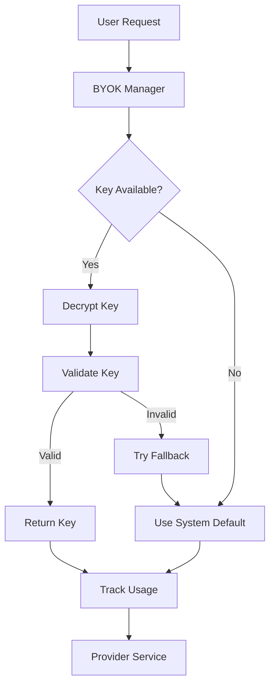

# @stack-2025/byok-core

**Bring Your Own Keys** - Secure API key management system for Stack 2025

## Overview

The BYOK (Bring Your Own Keys) system provides secure, multi-tenant API key storage and management for all LLM and telephony services in Stack 2025. Users can bring their own API keys for services like OpenAI, Google Gemini, Deepgram, and Twilio while maintaining security and isolation.

## Supported Services

### LLM Providers
- **OpenAI**: GPT-4, GPT-3.5, Realtime API
- **Google Gemini**: Live API, Flash models, Vertex AI
- **Anthropic**: Claude models (via API)
- **OpenRouter**: Multi-provider access

### Voice & Speech Services
- **Deepgram**: Voice Agent, 14+ Aura voices, STT/TTS
- **OpenAI**: Whisper, TTS
- **Google**: Speech-to-Text, Text-to-Speech

### Telephony Services
- **Twilio**: Voice, SMS, WhatsApp
- **Telnyx**: Voice, SMS

## Key Features

- 🔐 **Encrypted Storage**: AES-256-GCM encryption for all API keys
- 🏢 **Multi-tenant**: Complete isolation between users/organizations
- 🔄 **Key Rotation**: Support for seamless key rotation
- ✅ **Validation**: Automated key testing and validation
- 📊 **Usage Tracking**: Monitor API usage per key
- 🚨 **Fallback System**: Automatic failover to backup keys
- 🎯 **Rate Limiting**: Per-key rate limiting and quotas
- 📝 **Audit Logging**: Complete audit trail for key operations

## Installation

```bash
pnpm add @stack-2025/byok-core@file:../packages/byok-core
```

## Quick Start

```typescript
import { BYOKManager, ProviderType } from '@stack-2025/byok-core';

// Initialize BYOK manager
const byok = new BYOKManager({
  encryptionKey: process.env.BYOK_ENCRYPTION_KEY,
  database: db // Your database instance
});

// Add user's OpenAI key
await byok.addKey({
  userId: 'user_123',
  provider: ProviderType.OPENAI,
  keyData: {
    apiKey: 'sk-...',
    organization: 'org-...'
  },
  alias: 'My OpenAI Key'
});

// Get key for usage
const key = await byok.getActiveKey('user_123', ProviderType.OPENAI);

// Use with existing providers
const openaiClient = new OpenAI({
  apiKey: key.decryptedKey,
  organization: key.metadata.organization
});
```

## Architecture



## Database Schema

See [DATABASE_SCHEMA.md](./docs/DATABASE_SCHEMA.md) for complete schema documentation.

## Security

- All keys encrypted with AES-256-GCM
- Individual encryption keys per tenant
- Zero-knowledge architecture - we never see your keys in plain text
- Secure key derivation using PBKDF2
- Regular security audits and rotation

## Usage Patterns

### Personal Use
```typescript
// Individual developer with their own keys
await byok.addKey({
  userId: 'dev_123',
  provider: ProviderType.OPENAI,
  keyData: { apiKey: 'sk-personal...' }
});
```

### Team/Organization
```typescript
// Organization with shared keys
await byok.addKey({
  organizationId: 'org_456',
  provider: ProviderType.DEEPGRAM,
  keyData: { 
    apiKey: 'dg-team...', 
    projectId: 'proj_123' 
  },
  sharedAccess: true
});
```

### Development vs Production
```typescript
// Separate keys for different environments
await byok.addKey({
  userId: 'user_789',
  provider: ProviderType.TWILIO,
  environment: 'development',
  keyData: { 
    accountSid: 'ACtest...', 
    authToken: 'test-token...' 
  }
});

await byok.addKey({
  userId: 'user_789',
  provider: ProviderType.TWILIO,
  environment: 'production',
  keyData: { 
    accountSid: 'ACprod...', 
    authToken: 'prod-token...' 
  }
});
```

## API Reference

### BYOKManager

#### Methods

- `addKey(keyConfig)` - Add new API key
- `getActiveKey(userId, provider)` - Get active key for provider
- `listKeys(userId)` - List user's keys
- `updateKey(keyId, updates)` - Update existing key
- `deleteKey(keyId)` - Delete key
- `testKey(keyId)` - Test key validity
- `rotateKey(keyId, newKeyData)` - Rotate key
- `getUsageStats(keyId)` - Get usage statistics

### Key Validation

```typescript
// Test all keys for a user
const results = await byok.validateAllKeys('user_123');

// Test specific key
const isValid = await byok.testKey('key_456');

// Get key health status
const health = await byok.getKeyHealth('key_456');
```

## Integration Guide

### With Existing Packages

```typescript
// ai-general-core integration
import { createConfigWithBYOK } from '@stack-2025/byok-core';

const config = await createConfigWithBYOK(userId, {
  fallbackToSystem: true,
  preferredProviders: [ProviderType.OPENAI, ProviderType.ANTHROPIC]
});

// deepgram-agent-core integration
const deepgramConfig = await byok.getProviderConfig(
  userId, 
  ProviderType.DEEPGRAM
);

const agent = new DeepgramVoiceAgent(deepgramConfig);
```

## Monitoring & Analytics

```typescript
// Get usage analytics
const analytics = await byok.getAnalytics('user_123', {
  timeRange: '30d',
  providers: [ProviderType.OPENAI],
  metrics: ['requests', 'tokens', 'cost']
});

// Set up usage alerts
await byok.createUsageAlert({
  userId: 'user_123',
  provider: ProviderType.OPENAI,
  threshold: { cost: 100 }, // $100 limit
  period: 'monthly'
});
```

## Migration from Environment Variables

```typescript
// Migrate existing env-based setup
const migrationPlan = await byok.planMigration({
  from: 'environment',
  providers: [ProviderType.OPENAI, ProviderType.DEEPGRAM],
  preserveExisting: true
});

await byok.executeMigration(migrationPlan);
```

## Error Handling

```typescript
import { 
  BYOKError, 
  KeyNotFoundError, 
  KeyValidationError,
  EncryptionError 
} from '@stack-2025/byok-core';

try {
  const key = await byok.getActiveKey('user_123', ProviderType.OPENAI);
} catch (error) {
  if (error instanceof KeyNotFoundError) {
    // Handle missing key - maybe redirect to key setup
    console.log('No OpenAI key configured');
  } else if (error instanceof KeyValidationError) {
    // Handle invalid key
    console.log('Key is invalid or expired');
  }
}
```

## Contributing

See [CONTRIBUTING.md](./CONTRIBUTING.md) for development setup and guidelines.

## License

MIT - see [LICENSE](./LICENSE) for details.