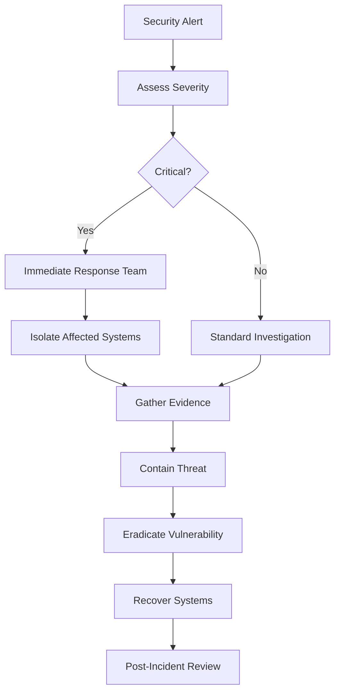

# BYOK Security Practices

Comprehensive security guidelines and best practices for the BYOK (Bring Your Own Keys) system in Stack 2025.

## Overview

The BYOK system implements enterprise-grade security measures to protect API keys and ensure secure multi-tenant operation. This document outlines security practices, implementation details, and compliance considerations.

## Security Architecture

### Defense in Depth

```
┌─────────────────────────────────────┐
│        Application Layer            │ ← Input validation, auth
├─────────────────────────────────────┤
│        Transport Security           │ ← TLS 1.3, certificate pinning
├─────────────────────────────────────┤
│        API Authentication           │ ← JWT tokens, rate limiting
├─────────────────────────────────────┤
│        Encryption Layer             │ ← AES-256-GCM, key derivation
├─────────────────────────────────────┤
│        Database Security            │ ← Encrypted at rest, isolation
├─────────────────────────────────────┤
│        Infrastructure Security      │ ← Network isolation, monitoring
└─────────────────────────────────────┘
```

### Zero-Knowledge Architecture

- **No Plain Text Storage**: All API keys encrypted before storage
- **User-Specific Encryption**: Each user has unique encryption keys
- **Key Derivation**: PBKDF2 with 100,000 iterations
- **Secure Deletion**: Cryptographic erasure of encryption keys

## Encryption Implementation

### AES-256-GCM Encryption

```typescript
// Encryption process
const userKey = deriveUserKey(userId, globalSecret, salt);
const nonce = generateSecureNonce(); // 96-bit
const encrypted = aes256gcm(plaintext, userKey, nonce);
const tag = authenticationTag; // 128-bit

// Storage format
{
  data: base64(encrypted + tag),
  nonce: base64(nonce),
  salt: base64(salt)
}
```

### Key Derivation

- **Algorithm**: PBKDF2-SHA256
- **Iterations**: 100,000 (configurable)
- **Salt**: 256-bit cryptographically secure random
- **Key Length**: 256-bit for AES-256

### Secure Key Generation

```typescript
// Master key generation
const masterKey = crypto.randomBytes(32).toString('hex');

// Entropy validation
const entropy = calculateShannonEntropy(key);
if (entropy < 7.5) {
  regenerateKey(); // Ensure high entropy
}
```

## Authentication & Authorization

### Multi-Factor Authentication

```typescript
// JWT with Ed25519 signatures
const token = jwt.sign(payload, privateKey, {
  algorithm: 'EdDSA',
  expiresIn: '24h',
  issuer: 'stack-2025-byok',
  audience: 'stack-2025'
});
```

### Role-Based Access Control (RBAC)

```typescript
interface UserPermissions {
  // Key operations
  'keys.create': boolean;
  'keys.read': boolean;
  'keys.update': boolean;
  'keys.delete': boolean;
  'keys.validate': boolean;
  
  // Organization operations  
  'org.keys.read': boolean;
  'org.keys.manage': boolean;
  'org.analytics.view': boolean;
  
  // System operations
  'system.audit.view': boolean;
  'system.config.update': boolean;
}
```

### API Rate Limiting

- **Per-User Limits**: 100 requests/minute
- **Per-IP Limits**: 1000 requests/hour
- **Sliding Window**: Redis-based rate limiting
- **Burst Protection**: Token bucket algorithm

## Data Protection

### Encryption at Rest

- **Database**: Transparent data encryption (TDE)
- **File Storage**: Full disk encryption
- **Backups**: Encrypted with separate keys
- **Key Rotation**: Quarterly automatic rotation

### Encryption in Transit

- **TLS 1.3**: All communications encrypted
- **Certificate Pinning**: Prevent MITM attacks
- **HSTS**: Force HTTPS connections
- **Perfect Forward Secrecy**: Ephemeral key exchange

### Data Classification

| Classification | Examples | Protection Level |
|----------------|----------|------------------|
| **Highly Confidential** | API keys, tokens | AES-256-GCM + HSM |
| **Confidential** | User data, analytics | AES-256-GCM |
| **Internal** | Metadata, logs | AES-256-CBC |
| **Public** | Documentation, schemas | TLS in transit |

## Multi-Tenant Security

### Tenant Isolation

```sql
-- Row-level security
CREATE POLICY user_isolation ON byok_keys
    FOR ALL TO application_user
    USING (user_id = current_setting('app.current_user_id'));

-- Encryption key isolation
CREATE UNIQUE INDEX idx_user_encryption_key 
    ON byok_users(user_id, encryption_key_hash);
```

### Cross-Tenant Protection

- **Logical Separation**: User ID in all queries
- **Encryption Isolation**: User-specific encryption keys
- **Audit Trails**: Complete tenant activity logging
- **Data Residency**: Geographic data placement controls

## Audit & Monitoring

### Comprehensive Audit Logging

```typescript
interface AuditEvent {
  timestamp: Date;
  userId: string;
  action: string;
  resource: string;
  ipAddress: string;
  userAgent: string;
  success: boolean;
  changes: {
    before: Record<string, any>;
    after: Record<string, any>;
  };
  riskScore: number; // 0-100
}
```

### Security Monitoring

- **Failed Authentication**: > 5 failures/hour
- **Unusual Access Patterns**: Geographic anomalies
- **High-Risk Operations**: Key deletion, export
- **Data Exfiltration**: Large data downloads
- **System Anomalies**: Performance degradation

### Real-time Alerting

```typescript
// Security alert conditions
const ALERT_CONDITIONS = {
  // Authentication
  'auth.failed_attempts': { threshold: 5, window: '1h' },
  'auth.brute_force': { threshold: 20, window: '1h' },
  
  // Access patterns
  'access.geographic_anomaly': { confidence: 0.8 },
  'access.time_anomaly': { confidence: 0.9 },
  
  // Operations
  'ops.bulk_deletion': { threshold: 10, window: '5m' },
  'ops.data_export': { size: '1GB', window: '1h' },
  
  // System
  'system.error_rate': { threshold: 0.05, window: '5m' },
  'system.latency': { threshold: '2s', window: '1m' }
};
```

## Vulnerability Management

### Secure Development Lifecycle (SDL)

1. **Threat Modeling**: STRIDE analysis for each component
2. **Static Analysis**: Code scanning for vulnerabilities
3. **Dynamic Testing**: Penetration testing and fuzzing
4. **Dependency Scanning**: Third-party vulnerability detection
5. **Security Reviews**: Manual code review for critical paths

### Common Vulnerabilities Protection

| Vulnerability | Protection Mechanism |
|---------------|----------------------|
| **SQL Injection** | Parameterized queries, ORM |
| **XSS** | Input sanitization, CSP headers |
| **CSRF** | CSRF tokens, SameSite cookies |
| **Session Hijacking** | Secure cookies, session rotation |
| **Timing Attacks** | Constant-time comparisons |
| **Side Channel** | Memory clearing, execution randomization |

### Dependency Security

```json
{
  "dependencies": {
    // Regularly updated and audited
    "crypto": "latest",
    "pg": "^8.11.0",
    "redis": "^4.6.0"
  },
  "devDependencies": {
    // Security testing tools
    "audit-ci": "^6.6.1",
    "eslint-plugin-security": "^1.7.1",
    "snyk": "^1.1230.0"
  }
}
```

## Incident Response

### Security Incident Classifications

| Severity | Description | Response Time |
|----------|-------------|---------------|
| **P0 - Critical** | Data breach, system compromise | < 15 minutes |
| **P1 - High** | Service disruption, key exposure | < 1 hour |
| **P2 - Medium** | Suspicious activity, failed validations | < 4 hours |
| **P3 - Low** | Policy violations, audit anomalies | < 24 hours |

### Incident Response Process



### Breach Response Procedures

1. **Detection**: Automated alerts and manual reporting
2. **Assessment**: Determine scope and severity
3. **Containment**: Isolate affected systems
4. **Investigation**: Forensic analysis of the incident
5. **Notification**: Legal and regulatory reporting
6. **Recovery**: System restoration and validation
7. **Lessons Learned**: Process improvement

## Compliance & Regulations

### Regulatory Compliance

- **GDPR**: Right to deletion, data portability
- **SOC 2 Type II**: Security, availability, confidentiality
- **PCI DSS**: If processing payment information
- **HIPAA**: If handling healthcare data
- **SOX**: Financial data controls

### Data Retention Policies

| Data Type | Retention Period | Deletion Method |
|-----------|------------------|-----------------|
| **API Keys** | User-controlled | Cryptographic erasure |
| **Audit Logs** | 7 years | Secure deletion |
| **Usage Analytics** | 2 years | Anonymization |
| **Error Logs** | 90 days | Standard deletion |
| **Backup Data** | 1 year | Encrypted destruction |

### Privacy by Design

```typescript
// Data minimization
interface UserData {
  id: string;              // Required
  email: string;           // Required for notifications
  // name: string;         // Not collected
  // location: string;     // Not stored
  settings: UserSettings; // Only functional data
}

// Purpose limitation
const PURPOSE_MAPPING = {
  'key_storage': ['encrypted_key_data', 'metadata'],
  'analytics': ['usage_stats', 'performance_metrics'],
  'audit': ['access_logs', 'security_events'],
  'support': ['error_logs', 'debug_info']
};
```

## Secure Configuration

### Environment Security

```bash
# Production environment variables
export BYOK_ENCRYPTION_KEY="$(openssl rand -hex 32)"
export BYOK_DB_SSL_MODE="require"
export BYOK_REDIS_TLS="true"
export BYOK_LOG_LEVEL="warn"
export BYOK_DEBUG_MODE="false"

# Security headers
export BYOK_CSP_POLICY="default-src 'self'; script-src 'self'"
export BYOK_HSTS_MAX_AGE="31536000"
export BYOK_REFERRER_POLICY="strict-origin-when-cross-origin"
```

### Infrastructure Security

```yaml
# Kubernetes security context
securityContext:
  runAsNonRoot: true
  runAsUser: 10001
  readOnlyRootFilesystem: true
  allowPrivilegeEscalation: false
  capabilities:
    drop:
      - ALL
```

### Database Security

```sql
-- Database security configuration
-- Encryption at rest
ALTER DATABASE byok SET encrypt_mode = 'required';

-- Connection security
ALTER SYSTEM SET ssl = 'on';
ALTER SYSTEM SET ssl_ciphers = 'HIGH:!aNULL:!MD5';
ALTER SYSTEM SET ssl_min_protocol_version = 'TLSv1.2';

-- Access controls
REVOKE ALL ON ALL TABLES IN SCHEMA public FROM PUBLIC;
GRANT USAGE ON SCHEMA byok TO byok_application;
```

## Security Testing

### Automated Security Testing

```typescript
// Security test suite
describe('BYOK Security', () => {
  describe('Encryption', () => {
    it('should use secure random nonces', () => {
      const nonces = Array.from({length: 1000}, () => generateNonce());
      const uniqueNonces = new Set(nonces);
      expect(uniqueNonces.size).toBe(nonces.length);
    });
    
    it('should validate key entropy', () => {
      const weakKey = 'abcd'.repeat(8);
      expect(() => new EncryptionService(weakKey)).toThrow();
    });
  });
  
  describe('Authentication', () => {
    it('should prevent timing attacks', async () => {
      const times = [];
      for (let i = 0; i < 100; i++) {
        const start = performance.now();
        await validateKey('invalid-key');
        times.push(performance.now() - start);
      }
      
      const variance = calculateVariance(times);
      expect(variance).toBeLessThan(TIMING_THRESHOLD);
    });
  });
});
```

### Penetration Testing

- **Quarterly External Tests**: Third-party security assessment
- **Monthly Internal Tests**: Automated vulnerability scanning
- **Continuous Monitoring**: Real-time threat detection
- **Bug Bounty Program**: Crowdsourced security research

## Security Checklist

### Development Security

- [ ] Input validation on all user inputs
- [ ] Output encoding to prevent XSS
- [ ] Parameterized queries for database access
- [ ] Secure session management
- [ ] Proper error handling (no information disclosure)
- [ ] Security headers in all responses
- [ ] Rate limiting on all endpoints
- [ ] Authentication required for protected resources

### Deployment Security

- [ ] TLS 1.3 configured correctly
- [ ] Database encryption enabled
- [ ] Secrets management configured
- [ ] Network segmentation implemented
- [ ] Monitoring and alerting active
- [ ] Backup encryption verified
- [ ] Access controls configured
- [ ] Security patching process active

### Operational Security

- [ ] Regular security assessments
- [ ] Incident response plan tested
- [ ] Staff security training completed
- [ ] Vendor security reviews conducted
- [ ] Compliance audits passed
- [ ] Key rotation procedures verified
- [ ] Backup restoration tested
- [ ] Disaster recovery plan validated

## Security Contacts

### Internal Security Team

- **Security Officer**: security@stack2025.com
- **DevSecOps Team**: devsecops@stack2025.com
- **Incident Response**: security-incident@stack2025.com

### External Resources

- **Security Advisors**: External security consultancy
- **Penetration Testers**: Third-party testing partners
- **Compliance Auditors**: Regulatory compliance specialists

### Emergency Contacts

- **24/7 Security Hotline**: +1-XXX-XXX-XXXX
- **Executive Escalation**: executive-security@stack2025.com
- **Legal Counsel**: legal@stack2025.com

---

**Document Classification**: Confidential  
**Last Updated**: August 2025  
**Review Schedule**: Quarterly  
**Approved By**: Security Committee