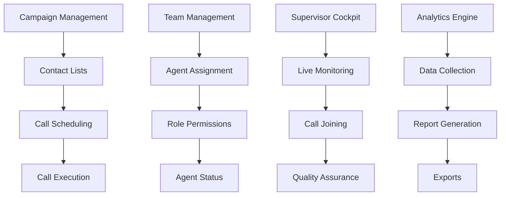

# CC-Lite 2026 - Technical Implementation Guide

**Version:** 1.0.0
**Date:** November 10, 2025
**Purpose:** Step-by-step technical guide for implementing all features

---

## 🎯 Implementation Priority Matrix

### Critical Path Features (Must Have)



---

## 🏗️ Week 1-2: Campaign Management Implementation

### Day 1-2: Database & Models

```python
# backend/app/campaigns/models.py

from sqlalchemy import Column, String, Text, DateTime, Integer, ForeignKey, Enum, JSON
from sqlalchemy.orm import relationship
from sqlalchemy.dialects.postgresql import UUID
from app.core.database import Base
from datetime import datetime
import uuid
import enum

class CampaignStatus(str, enum.Enum):
    DRAFT = "draft"
    SCHEDULED = "scheduled"
    ACTIVE = "active"
    PAUSED = "paused"
    COMPLETED = "completed"
    CANCELLED = "cancelled"

class Campaign(Base):
    __tablename__ = "campaigns"

    # Primary fields
    id = Column(UUID(as_uuid=True), primary_key=True, default=uuid.uuid4)
    name = Column(String(255), nullable=False, index=True)
    description = Column(Text)
    status = Column(Enum(CampaignStatus), default=CampaignStatus.DRAFT)

    # Scheduling
    start_date = Column(DateTime)
    end_date = Column(DateTime)
    timezone = Column(String(50), default="UTC")
    schedule_config = Column(JSON)  # Cron expressions, time windows

    # Configuration
    max_concurrent_calls = Column(Integer, default=10)
    retry_attempts = Column(Integer, default=3)
    retry_delay_seconds = Column(Integer, default=300)

    # Metrics
    total_contacts = Column(Integer, default=0)
    contacted = Column(Integer, default=0)
    successful = Column(Integer, default=0)
    failed = Column(Integer, default=0)

    # Audit fields
    created_at = Column(DateTime, default=datetime.utcnow)
    updated_at = Column(DateTime, default=datetime.utcnow, onupdate=datetime.utcnow)
    created_by_id = Column(UUID(as_uuid=True), ForeignKey("users.id"))
    organization_id = Column(UUID(as_uuid=True), ForeignKey("organizations.id"))

    # Relationships
    contact_lists = relationship("ContactList", back_populates="campaign", cascade="all, delete-orphan")
    call_flows = relationship("CallFlow", back_populates="campaign", cascade="all, delete-orphan")
    campaign_calls = relationship("CampaignCall", back_populates="campaign")
    created_by = relationship("User", back_populates="campaigns")

class ContactList(Base):
    __tablename__ = "contact_lists"

    id = Column(UUID(as_uuid=True), primary_key=True, default=uuid.uuid4)
    campaign_id = Column(UUID(as_uuid=True), ForeignKey("campaigns.id", ondelete="CASCADE"))
    name = Column(String(255))

    # Contact storage (normalized)
    total_contacts = Column(Integer, default=0)
    processed_contacts = Column(Integer, default=0)

    # Import tracking
    import_file_name = Column(String(255))
    import_status = Column(String(50))
    import_errors = Column(JSON)

    created_at = Column(DateTime, default=datetime.utcnow)

    # Relationships
    campaign = relationship("Campaign", back_populates="contact_lists")
    contacts = relationship("Contact", back_populates="contact_list", cascade="all, delete-orphan")

class Contact(Base):
    __tablename__ = "contacts"

    id = Column(UUID(as_uuid=True), primary_key=True, default=uuid.uuid4)
    contact_list_id = Column(UUID(as_uuid=True), ForeignKey("contact_lists.id", ondelete="CASCADE"))

    # Contact information
    phone_number = Column(String(20), nullable=False, index=True)
    first_name = Column(String(100))
    last_name = Column(String(100))
    email = Column(String(255))

    # Custom fields (flexible schema)
    custom_fields = Column(JSON)

    # Status tracking
    status = Column(String(50), default="pending")  # pending, calling, completed, failed, skipped
    last_attempt_at = Column(DateTime)
    attempts = Column(Integer, default=0)

    # Relationships
    contact_list = relationship("ContactList", back_populates="contacts")
    campaign_calls = relationship("CampaignCall", back_populates="contact")

class CallFlow(Base):
    __tablename__ = "call_flows"

    id = Column(UUID(as_uuid=True), primary_key=True, default=uuid.uuid4)
    campaign_id = Column(UUID(as_uuid=True), ForeignKey("campaigns.id", ondelete="CASCADE"))
    name = Column(String(255))
    version = Column(Integer, default=1)

    # Flow definition (JSON structure for flexibility)
    flow_definition = Column(JSON, nullable=False)
    # Example structure:
    # {
    #   "nodes": [
    #     {"id": "start", "type": "start", "next": "greeting"},
    #     {"id": "greeting", "type": "speak", "text": "Hello {first_name}", "next": "menu"},
    #     {"id": "menu", "type": "menu", "options": [...], "timeout": 10}
    #   ]
    # }

    is_active = Column(Boolean, default=True)
    created_at = Column(DateTime, default=datetime.utcnow)

    # Relationships
    campaign = relationship("Campaign", back_populates="call_flows")

class CampaignCall(Base):
    __tablename__ = "campaign_calls"

    id = Column(UUID(as_uuid=True), primary_key=True, default=uuid.uuid4)
    campaign_id = Column(UUID(as_uuid=True), ForeignKey("campaigns.id"))
    contact_id = Column(UUID(as_uuid=True), ForeignKey("contacts.id"))
    call_id = Column(UUID(as_uuid=True), ForeignKey("calls.id"))

    # Call outcome
    status = Column(String(50))  # connected, no_answer, busy, failed, voicemail
    duration_seconds = Column(Integer)
    disposition = Column(String(100))  # interested, not_interested, callback, dnc

    # Scheduling
    scheduled_at = Column(DateTime)
    called_at = Column(DateTime)

    # Relationships
    campaign = relationship("Campaign", back_populates="campaign_calls")
    contact = relationship("Contact", back_populates="campaign_calls")
    call = relationship("Call")
```

### Day 3-4: API Endpoints & Services

```python
# backend/app/campaigns/schemas.py

from pydantic import BaseModel, Field, validator
from typing import Optional, List, Dict, Any
from datetime import datetime
from uuid import UUID
from enum import Enum

class CampaignStatus(str, Enum):
    DRAFT = "draft"
    SCHEDULED = "scheduled"
    ACTIVE = "active"
    PAUSED = "paused"
    COMPLETED = "completed"
    CANCELLED = "cancelled"

class CampaignCreate(BaseModel):
    name: str = Field(..., min_length=1, max_length=255)
    description: Optional[str] = None
    start_date: Optional[datetime] = None
    end_date: Optional[datetime] = None
    timezone: str = "UTC"
    max_concurrent_calls: int = Field(default=10, ge=1, le=100)
    retry_attempts: int = Field(default=3, ge=0, le=10)
    retry_delay_seconds: int = Field(default=300, ge=60, le=3600)

    @validator('end_date')
    def end_after_start(cls, v, values):
        if v and 'start_date' in values and values['start_date']:
            if v <= values['start_date']:
                raise ValueError('end_date must be after start_date')
        return v

class CampaignUpdate(BaseModel):
    name: Optional[str] = Field(None, min_length=1, max_length=255)
    description: Optional[str] = None
    start_date: Optional[datetime] = None
    end_date: Optional[datetime] = None
    status: Optional[CampaignStatus] = None
    max_concurrent_calls: Optional[int] = Field(None, ge=1, le=100)

class CampaignResponse(BaseModel):
    id: UUID
    name: str
    description: Optional[str]
    status: CampaignStatus
    start_date: Optional[datetime]
    end_date: Optional[datetime]
    timezone: str
    total_contacts: int
    contacted: int
    successful: int
    failed: int
    created_at: datetime
    updated_at: datetime

    class Config:
        from_attributes = True

class ContactImport(BaseModel):
    contact_list_name: str
    contacts: List[Dict[str, Any]]
    # Or for CSV import:
    # csv_content: str

class ContactResponse(BaseModel):
    id: UUID
    phone_number: str
    first_name: Optional[str]
    last_name: Optional[str]
    email: Optional[str]
    status: str
    attempts: int
    custom_fields: Optional[Dict[str, Any]]

    class Config:
        from_attributes = True

class CallFlowNode(BaseModel):
    id: str
    type: str  # start, speak, listen, menu, transfer, hangup
    properties: Dict[str, Any]
    next: Optional[str] = None

class CallFlowCreate(BaseModel):
    name: str
    nodes: List[CallFlowNode]

class CampaignMetrics(BaseModel):
    campaign_id: UUID
    total_contacts: int
    contacted: int
    successful: int
    failed: int
    in_progress: int
    average_duration: float
    success_rate: float
    connection_rate: float
    hourly_stats: List[Dict[str, Any]]

# backend/app/campaigns/routes.py

from fastapi import APIRouter, Depends, HTTPException, UploadFile, File, BackgroundTasks
from sqlalchemy.orm import Session
from typing import List, Optional
from uuid import UUID
from app.core.database import get_db
from app.core.auth import get_current_user
from app.campaigns import schemas, service
from app.core.patterns.circuit_breaker import circuit_breaker
from app.core.logging import get_logger

router = APIRouter()
logger = get_logger(__name__)

@router.post("/", response_model=schemas.CampaignResponse, status_code=201)
@circuit_breaker(failure_threshold=5, timeout=60)
async def create_campaign(
    campaign: schemas.CampaignCreate,
    db: Session = Depends(get_db),
    current_user = Depends(get_current_user)
):
    """Create a new campaign"""
    logger.info(f"Creating campaign: {campaign.name}", extra={"user_id": current_user.id})

    try:
        campaign_service = service.CampaignService(db)
        result = await campaign_service.create(campaign, current_user)

        # Add Prometheus metrics
        from app.monitoring.prometheus_metrics import campaign_created_counter
        campaign_created_counter.inc()

        logger.info(f"Campaign created: {result.id}")
        return result

    except Exception as e:
        logger.error(f"Failed to create campaign: {str(e)}", exc_info=True)
        raise HTTPException(status_code=500, detail=str(e))

@router.get("/", response_model=List[schemas.CampaignResponse])
async def list_campaigns(
    skip: int = 0,
    limit: int = 100,
    status: Optional[schemas.CampaignStatus] = None,
    db: Session = Depends(get_db),
    current_user = Depends(get_current_user)
):
    """List all campaigns for the user's organization"""
    campaign_service = service.CampaignService(db)
    return await campaign_service.list(
        organization_id=current_user.organization_id,
        status=status,
        skip=skip,
        limit=limit
    )

@router.get("/{campaign_id}", response_model=schemas.CampaignResponse)
async def get_campaign(
    campaign_id: UUID,
    db: Session = Depends(get_db),
    current_user = Depends(get_current_user)
):
    """Get campaign details"""
    campaign_service = service.CampaignService(db)
    campaign = await campaign_service.get(campaign_id, current_user.organization_id)

    if not campaign:
        raise HTTPException(status_code=404, detail="Campaign not found")

    return campaign

@router.put("/{campaign_id}", response_model=schemas.CampaignResponse)
async def update_campaign(
    campaign_id: UUID,
    campaign_update: schemas.CampaignUpdate,
    db: Session = Depends(get_db),
    current_user = Depends(get_current_user)
):
    """Update campaign"""
    campaign_service = service.CampaignService(db)

    campaign = await campaign_service.update(
        campaign_id,
        campaign_update,
        current_user.organization_id
    )

    if not campaign:
        raise HTTPException(status_code=404, detail="Campaign not found")

    return campaign

@router.delete("/{campaign_id}", status_code=204)
async def delete_campaign(
    campaign_id: UUID,
    db: Session = Depends(get_db),
    current_user = Depends(get_current_user)
):
    """Delete campaign"""
    campaign_service = service.CampaignService(db)

    success = await campaign_service.delete(campaign_id, current_user.organization_id)

    if not success:
        raise HTTPException(status_code=404, detail="Campaign not found")

@router.post("/{campaign_id}/contacts/import", status_code=202)
async def import_contacts(
    campaign_id: UUID,
    file: UploadFile = File(...),
    background_tasks: BackgroundTasks,
    db: Session = Depends(get_db),
    current_user = Depends(get_current_user)
):
    """Import contacts from CSV file"""
    # Validate file
    if not file.filename.endswith('.csv'):
        raise HTTPException(status_code=400, detail="Only CSV files are supported")

    # Start background import
    campaign_service = service.CampaignService(db)
    background_tasks.add_task(
        campaign_service.import_contacts_async,
        campaign_id,
        file,
        current_user
    )

    return {"message": "Contact import started", "campaign_id": campaign_id}

@router.get("/{campaign_id}/contacts", response_model=List[schemas.ContactResponse])
async def list_contacts(
    campaign_id: UUID,
    skip: int = 0,
    limit: int = 100,
    status: Optional[str] = None,
    db: Session = Depends(get_db),
    current_user = Depends(get_current_user)
):
    """List campaign contacts"""
    campaign_service = service.CampaignService(db)
    return await campaign_service.list_contacts(
        campaign_id,
        current_user.organization_id,
        status=status,
        skip=skip,
        limit=limit
    )

@router.post("/{campaign_id}/flow", response_model=Dict)
async def create_call_flow(
    campaign_id: UUID,
    flow: schemas.CallFlowCreate,
    db: Session = Depends(get_db),
    current_user = Depends(get_current_user)
):
    """Create or update call flow for campaign"""
    campaign_service = service.CampaignService(db)
    return await campaign_service.create_call_flow(
        campaign_id,
        flow,
        current_user.organization_id
    )

@router.post("/{campaign_id}/start", status_code=200)
@circuit_breaker(failure_threshold=3, timeout=30)
async def start_campaign(
    campaign_id: UUID,
    background_tasks: BackgroundTasks,
    db: Session = Depends(get_db),
    current_user = Depends(get_current_user)
):
    """Start campaign execution"""
    campaign_service = service.CampaignService(db)

    # Validate campaign is ready
    campaign = await campaign_service.get(campaign_id, current_user.organization_id)

    if not campaign:
        raise HTTPException(status_code=404, detail="Campaign not found")

    if campaign.status not in [schemas.CampaignStatus.DRAFT, schemas.CampaignStatus.SCHEDULED]:
        raise HTTPException(status_code=400, detail=f"Cannot start campaign in {campaign.status} status")

    if campaign.total_contacts == 0:
        raise HTTPException(status_code=400, detail="Campaign has no contacts")

    # Start campaign in background
    background_tasks.add_task(
        campaign_service.start_campaign_async,
        campaign_id
    )

    # Update status
    await campaign_service.update_status(campaign_id, schemas.CampaignStatus.ACTIVE)

    # Metrics
    from app.monitoring.prometheus_metrics import campaign_started_counter
    campaign_started_counter.inc()

    return {"message": "Campaign started", "campaign_id": campaign_id}

@router.post("/{campaign_id}/pause", status_code=200)
async def pause_campaign(
    campaign_id: UUID,
    db: Session = Depends(get_db),
    current_user = Depends(get_current_user)
):
    """Pause campaign execution"""
    campaign_service = service.CampaignService(db)

    success = await campaign_service.pause_campaign(campaign_id, current_user.organization_id)

    if not success:
        raise HTTPException(status_code=400, detail="Cannot pause campaign")

    return {"message": "Campaign paused", "campaign_id": campaign_id}

@router.post("/{campaign_id}/stop", status_code=200)
async def stop_campaign(
    campaign_id: UUID,
    db: Session = Depends(get_db),
    current_user = Depends(get_current_user)
):
    """Stop campaign execution"""
    campaign_service = service.CampaignService(db)

    success = await campaign_service.stop_campaign(campaign_id, current_user.organization_id)

    if not success:
        raise HTTPException(status_code=400, detail="Cannot stop campaign")

    return {"message": "Campaign stopped", "campaign_id": campaign_id}

@router.get("/{campaign_id}/metrics", response_model=schemas.CampaignMetrics)
async def get_campaign_metrics(
    campaign_id: UUID,
    db: Session = Depends(get_db),
    current_user = Depends(get_current_user)
):
    """Get campaign performance metrics"""
    campaign_service = service.CampaignService(db)
    return await campaign_service.get_metrics(campaign_id, current_user.organization_id)
```

### Day 5-6: Campaign Service Implementation

```python
# backend/app/campaigns/service.py

from typing import List, Optional, Dict, Any
from uuid import UUID
from datetime import datetime, timedelta
import csv
import io
import asyncio
from sqlalchemy.orm import Session
from sqlalchemy import and_, or_
from fastapi import UploadFile
from app.campaigns import models, schemas
from app.core.logging import get_logger
from app.providers.telephony import TwilioProvider, TelnyxProvider
from app.sessions.service import SessionService
from app.core.patterns.circuit_breaker import CircuitBreaker

logger = get_logger(__name__)

class CampaignService:
    def __init__(self, db: Session):
        self.db = db
        self.circuit_breaker = CircuitBreaker(
            failure_threshold=5,
            timeout=60,
            expected_exception=Exception
        )
        self.session_service = SessionService(db)

    async def create(self, campaign_data: schemas.CampaignCreate, current_user) -> models.Campaign:
        """Create a new campaign"""
        campaign = models.Campaign(
            **campaign_data.dict(),
            created_by_id=current_user.id,
            organization_id=current_user.organization_id
        )

        self.db.add(campaign)
        self.db.commit()
        self.db.refresh(campaign)

        logger.info(f"Campaign created: {campaign.id}")

        # Publish event
        from app.core.events import event_publisher
        await event_publisher.publish({
            "type": "campaign.created",
            "data": {
                "campaign_id": str(campaign.id),
                "name": campaign.name,
                "created_by": str(current_user.id)
            }
        })

        return campaign

    async def list(
        self,
        organization_id: UUID,
        status: Optional[schemas.CampaignStatus] = None,
        skip: int = 0,
        limit: int = 100
    ) -> List[models.Campaign]:
        """List campaigns for an organization"""
        query = self.db.query(models.Campaign).filter(
            models.Campaign.organization_id == organization_id
        )

        if status:
            query = query.filter(models.Campaign.status == status)

        return query.offset(skip).limit(limit).all()

    async def get(self, campaign_id: UUID, organization_id: UUID) -> Optional[models.Campaign]:
        """Get campaign by ID"""
        return self.db.query(models.Campaign).filter(
            and_(
                models.Campaign.id == campaign_id,
                models.Campaign.organization_id == organization_id
            )
        ).first()

    async def update(
        self,
        campaign_id: UUID,
        update_data: schemas.CampaignUpdate,
        organization_id: UUID
    ) -> Optional[models.Campaign]:
        """Update campaign"""
        campaign = await self.get(campaign_id, organization_id)

        if not campaign:
            return None

        # Update fields
        for field, value in update_data.dict(exclude_unset=True).items():
            setattr(campaign, field, value)

        campaign.updated_at = datetime.utcnow()

        self.db.commit()
        self.db.refresh(campaign)

        # Publish event
        from app.core.events import event_publisher
        await event_publisher.publish({
            "type": "campaign.updated",
            "data": {
                "campaign_id": str(campaign.id),
                "changes": update_data.dict(exclude_unset=True)
            }
        })

        return campaign

    async def delete(self, campaign_id: UUID, organization_id: UUID) -> bool:
        """Delete campaign"""
        campaign = await self.get(campaign_id, organization_id)

        if not campaign:
            return False

        # Check if campaign is active
        if campaign.status == schemas.CampaignStatus.ACTIVE:
            raise Exception("Cannot delete active campaign")

        self.db.delete(campaign)
        self.db.commit()

        logger.info(f"Campaign deleted: {campaign_id}")

        return True

    async def import_contacts_async(
        self,
        campaign_id: UUID,
        file: UploadFile,
        current_user
    ):
        """Import contacts from CSV file (background task)"""
        try:
            logger.info(f"Starting contact import for campaign {campaign_id}")

            # Get campaign
            campaign = await self.get(campaign_id, current_user.organization_id)
            if not campaign:
                logger.error(f"Campaign not found: {campaign_id}")
                return

            # Create contact list
            contact_list = models.ContactList(
                campaign_id=campaign_id,
                name=f"Import from {file.filename}",
                import_file_name=file.filename,
                import_status="processing"
            )
            self.db.add(contact_list)
            self.db.commit()

            # Read CSV
            content = await file.read()
            csv_reader = csv.DictReader(io.StringIO(content.decode('utf-8')))

            contacts_added = 0
            errors = []

            for row_num, row in enumerate(csv_reader, start=2):  # Start at 2 (header is 1)
                try:
                    # Validate phone number
                    phone = row.get('phone', row.get('phone_number', '')).strip()
                    if not phone:
                        errors.append(f"Row {row_num}: Missing phone number")
                        continue

                    # Create contact
                    contact = models.Contact(
                        contact_list_id=contact_list.id,
                        phone_number=phone,
                        first_name=row.get('first_name', ''),
                        last_name=row.get('last_name', ''),
                        email=row.get('email', ''),
                        custom_fields={k: v for k, v in row.items()
                                     if k not in ['phone', 'phone_number', 'first_name', 'last_name', 'email']}
                    )
                    self.db.add(contact)
                    contacts_added += 1

                    # Batch commit every 100 contacts
                    if contacts_added % 100 == 0:
                        self.db.commit()
                        logger.info(f"Imported {contacts_added} contacts so far")

                except Exception as e:
                    errors.append(f"Row {row_num}: {str(e)}")

            # Final commit
            self.db.commit()

            # Update contact list
            contact_list.total_contacts = contacts_added
            contact_list.import_status = "completed"
            contact_list.import_errors = errors if errors else None

            # Update campaign
            campaign.total_contacts = self.db.query(models.Contact).join(
                models.ContactList
            ).filter(
                models.ContactList.campaign_id == campaign_id
            ).count()

            self.db.commit()

            logger.info(f"Contact import completed: {contacts_added} contacts imported")

            # Publish event
            from app.core.events import event_publisher
            await event_publisher.publish({
                "type": "campaign.contacts_imported",
                "data": {
                    "campaign_id": str(campaign_id),
                    "contacts_imported": contacts_added,
                    "errors": len(errors)
                }
            })

        except Exception as e:
            logger.error(f"Contact import failed: {str(e)}", exc_info=True)

            if contact_list:
                contact_list.import_status = "failed"
                contact_list.import_errors = [str(e)]
                self.db.commit()

    async def create_call_flow(
        self,
        campaign_id: UUID,
        flow_data: schemas.CallFlowCreate,
        organization_id: UUID
    ) -> models.CallFlow:
        """Create or update call flow"""
        campaign = await self.get(campaign_id, organization_id)

        if not campaign:
            raise Exception("Campaign not found")

        # Deactivate existing flows
        self.db.query(models.CallFlow).filter(
            models.CallFlow.campaign_id == campaign_id
        ).update({"is_active": False})

        # Create new flow
        call_flow = models.CallFlow(
            campaign_id=campaign_id,
            name=flow_data.name,
            flow_definition={
                "nodes": [node.dict() for node in flow_data.nodes]
            }
        )

        self.db.add(call_flow)
        self.db.commit()
        self.db.refresh(call_flow)

        logger.info(f"Call flow created for campaign {campaign_id}")

        return call_flow

    async def start_campaign_async(self, campaign_id: UUID):
        """Start campaign execution (background task)"""
        try:
            logger.info(f"Starting campaign execution: {campaign_id}")

            campaign = self.db.query(models.Campaign).filter(
                models.Campaign.id == campaign_id
            ).first()

            if not campaign:
                logger.error(f"Campaign not found: {campaign_id}")
                return

            # Get active call flow
            call_flow = self.db.query(models.CallFlow).filter(
                and_(
                    models.CallFlow.campaign_id == campaign_id,
                    models.CallFlow.is_active == True
                )
            ).first()

            if not call_flow:
                logger.error(f"No active call flow for campaign: {campaign_id}")
                return

            # Get contacts to call
            contacts = self.db.query(models.Contact).join(
                models.ContactList
            ).filter(
                and_(
                    models.ContactList.campaign_id == campaign_id,
                    models.Contact.status == "pending"
                )
            ).all()

            logger.info(f"Found {len(contacts)} contacts to call")

            # Process contacts with rate limiting
            concurrent_calls = 0
            max_concurrent = campaign.max_concurrent_calls

            for contact in contacts:
                # Check if campaign is still active
                campaign = self.db.query(models.Campaign).filter(
                    models.Campaign.id == campaign_id
                ).first()

                if campaign.status != schemas.CampaignStatus.ACTIVE:
                    logger.info(f"Campaign {campaign_id} is no longer active")
                    break

                # Wait if at max concurrent calls
                while concurrent_calls >= max_concurrent:
                    await asyncio.sleep(1)
                    # Update concurrent_calls based on completed calls
                    # (simplified - in production, track via Redis or DB)
                    concurrent_calls = max(0, concurrent_calls - 1)

                # Start call
                concurrent_calls += 1
                asyncio.create_task(
                    self._execute_campaign_call(
                        campaign,
                        contact,
                        call_flow
                    )
                )

                # Rate limiting
                await asyncio.sleep(0.5)  # 2 calls per second max

            # Wait for all calls to complete
            await asyncio.sleep(10)  # Simplified - use proper tracking

            # Update campaign status
            campaign.status = schemas.CampaignStatus.COMPLETED
            self.db.commit()

            logger.info(f"Campaign execution completed: {campaign_id}")

        except Exception as e:
            logger.error(f"Campaign execution failed: {str(e)}", exc_info=True)

            # Update campaign status
            campaign = self.db.query(models.Campaign).filter(
                models.Campaign.id == campaign_id
            ).first()

            if campaign:
                campaign.status = schemas.CampaignStatus.FAILED
                self.db.commit()

    async def _execute_campaign_call(
        self,
        campaign: models.Campaign,
        contact: models.Contact,
        call_flow: models.CallFlow
    ):
        """Execute a single campaign call"""
        try:
            logger.info(f"Calling contact {contact.id} for campaign {campaign.id}")

            # Update contact status
            contact.status = "calling"
            contact.attempts += 1
            contact.last_attempt_at = datetime.utcnow()
            self.db.commit()

            # Create call session
            from app.sessions.schemas import SessionCreate
            session_data = SessionCreate(
                provider_type="twilio",  # Or based on campaign config
                provider_model="voice",
                custom_instructions=f"Campaign: {campaign.name}",
                metadata={
                    "campaign_id": str(campaign.id),
                    "contact_id": str(contact.id),
                    "call_flow": call_flow.flow_definition
                }
            )

            session = await self.session_service.create_session(session_data, None)

            # Initiate call via telephony provider
            # (Simplified - integrate with existing telephony system)
            call_result = await self._make_call(
                phone_number=contact.phone_number,
                session_id=session.id,
                call_flow=call_flow.flow_definition
            )

            # Create campaign call record
            campaign_call = models.CampaignCall(
                campaign_id=campaign.id,
                contact_id=contact.id,
                call_id=session.id,  # Or actual call ID from provider
                status=call_result.get("status", "failed"),
                duration_seconds=call_result.get("duration", 0),
                disposition=call_result.get("disposition"),
                called_at=datetime.utcnow()
            )
            self.db.add(campaign_call)

            # Update contact status
            contact.status = "completed" if call_result.get("status") == "connected" else "failed"

            # Update campaign metrics
            campaign.contacted += 1
            if call_result.get("status") == "connected":
                campaign.successful += 1
            else:
                campaign.failed += 1

            self.db.commit()

            logger.info(f"Call completed for contact {contact.id}: {call_result.get('status')}")

        except Exception as e:
            logger.error(f"Failed to execute campaign call: {str(e)}", exc_info=True)

            # Update contact status
            contact.status = "failed"
            campaign.failed += 1
            self.db.commit()

    async def _make_call(
        self,
        phone_number: str,
        session_id: UUID,
        call_flow: Dict[str, Any]
    ) -> Dict[str, Any]:
        """Make actual call via telephony provider"""
        # This integrates with existing telephony system
        # For now, return mock result

        # In production, use:
        # - TwilioProvider or TelnyxProvider
        # - Circuit breaker for resilience
        # - Actual call flow execution

        return {
            "status": "connected",
            "duration": 120,
            "disposition": "interested"
        }

    async def pause_campaign(self, campaign_id: UUID, organization_id: UUID) -> bool:
        """Pause campaign execution"""
        campaign = await self.get(campaign_id, organization_id)

        if not campaign or campaign.status != schemas.CampaignStatus.ACTIVE:
            return False

        campaign.status = schemas.CampaignStatus.PAUSED
        self.db.commit()

        logger.info(f"Campaign paused: {campaign_id}")

        return True

    async def stop_campaign(self, campaign_id: UUID, organization_id: UUID) -> bool:
        """Stop campaign execution"""
        campaign = await self.get(campaign_id, organization_id)

        if not campaign or campaign.status not in [
            schemas.CampaignStatus.ACTIVE,
            schemas.CampaignStatus.PAUSED
        ]:
            return False

        campaign.status = schemas.CampaignStatus.CANCELLED
        self.db.commit()

        logger.info(f"Campaign stopped: {campaign_id}")

        return True

    async def get_metrics(self, campaign_id: UUID, organization_id: UUID) -> schemas.CampaignMetrics:
        """Get campaign performance metrics"""
        campaign = await self.get(campaign_id, organization_id)

        if not campaign:
            raise Exception("Campaign not found")

        # Calculate metrics
        success_rate = (campaign.successful / campaign.contacted * 100) if campaign.contacted > 0 else 0
        connection_rate = (campaign.contacted / campaign.total_contacts * 100) if campaign.total_contacts > 0 else 0

        # Get average duration
        avg_duration = self.db.query(
            func.avg(models.CampaignCall.duration_seconds)
        ).filter(
            models.CampaignCall.campaign_id == campaign_id
        ).scalar() or 0

        # Get hourly stats (simplified)
        hourly_stats = []  # Would aggregate by hour in production

        return schemas.CampaignMetrics(
            campaign_id=campaign_id,
            total_contacts=campaign.total_contacts,
            contacted=campaign.contacted,
            successful=campaign.successful,
            failed=campaign.failed,
            in_progress=campaign.total_contacts - campaign.contacted,
            average_duration=avg_duration,
            success_rate=success_rate,
            connection_rate=connection_rate,
            hourly_stats=hourly_stats
        )
```

### Day 7-8: Frontend Implementation

```typescript
// frontend/src/routes/campaigns/+page.svelte

<script lang="ts">
  import { onMount } from 'svelte';
  import { goto } from '$app/navigation';
  import { campaignStore } from '$lib/stores/campaigns';
  import CampaignList from '$lib/components/campaigns/CampaignList.svelte';
  import { Button } from '$lib/components/ui';

  let campaigns = [];
  let loading = true;
  let error = null;

  onMount(async () => {
    try {
      await campaignStore.loadCampaigns();
      campaigns = $campaignStore.campaigns;
    } catch (err) {
      error = err.message;
    } finally {
      loading = false;
    }
  });

  function handleCreateCampaign() {
    goto('/campaigns/new');
  }
</script>

<div class="container mx-auto p-6">
  <div class="flex justify-between items-center mb-6">
    <h1 class="text-3xl font-bold">Campaigns</h1>
    <Button on:click={handleCreateCampaign}>
      Create Campaign
    </Button>
  </div>

  {#if loading}
    <div class="flex justify-center p-12">
      <div class="spinner" />
    </div>
  {:else if error}
    <div class="alert alert-error">
      {error}
    </div>
  {:else}
    <CampaignList {campaigns} />
  {/if}
</div>

// frontend/src/routes/campaigns/new/+page.svelte

<script lang="ts">
  import { goto } from '$app/navigation';
  import CampaignWizard from '$lib/components/campaigns/CampaignWizard.svelte';
  import { campaignStore } from '$lib/stores/campaigns';

  async function handleCreateCampaign(data) {
    try {
      const campaign = await campaignStore.createCampaign(data);
      goto(`/campaigns/${campaign.id}`);
    } catch (error) {
      console.error('Failed to create campaign:', error);
    }
  }
</script>

<div class="container mx-auto p-6">
  <h1 class="text-3xl font-bold mb-6">Create Campaign</h1>
  <CampaignWizard on:submit={handleCreateCampaign} />
</div>

// frontend/src/lib/stores/campaigns.ts

import { writable, derived } from 'svelte/store';
import { api } from '$lib/api';

interface Campaign {
  id: string;
  name: string;
  status: string;
  total_contacts: number;
  contacted: number;
  successful: number;
  failed: number;
  created_at: string;
  updated_at: string;
}

function createCampaignStore() {
  const { subscribe, set, update } = writable({
    campaigns: [] as Campaign[],
    currentCampaign: null as Campaign | null,
    loading: false,
    error: null
  });

  return {
    subscribe,

    async loadCampaigns() {
      update(s => ({ ...s, loading: true, error: null }));

      try {
        const response = await api.get('/api/campaigns');
        const campaigns = await response.json();

        update(s => ({
          ...s,
          campaigns,
          loading: false
        }));

        return campaigns;
      } catch (error) {
        update(s => ({
          ...s,
          error: error.message,
          loading: false
        }));
        throw error;
      }
    },

    async createCampaign(data: any) {
      const response = await api.post('/api/campaigns', data);
      const campaign = await response.json();

      update(s => ({
        ...s,
        campaigns: [...s.campaigns, campaign]
      }));

      return campaign;
    },

    async updateCampaign(id: string, data: any) {
      const response = await api.put(`/api/campaigns/${id}`, data);
      const updated = await response.json();

      update(s => ({
        ...s,
        campaigns: s.campaigns.map(c =>
          c.id === id ? updated : c
        ),
        currentCampaign: s.currentCampaign?.id === id ? updated : s.currentCampaign
      }));

      return updated;
    },

    async startCampaign(id: string) {
      await api.post(`/api/campaigns/${id}/start`);

      update(s => ({
        ...s,
        campaigns: s.campaigns.map(c =>
          c.id === id ? { ...c, status: 'active' } : c
        )
      }));
    },

    async pauseCampaign(id: string) {
      await api.post(`/api/campaigns/${id}/pause`);

      update(s => ({
        ...s,
        campaigns: s.campaigns.map(c =>
          c.id === id ? { ...c, status: 'paused' } : c
        )
      }));
    },

    async stopCampaign(id: string) {
      await api.post(`/api/campaigns/${id}/stop`);

      update(s => ({
        ...s,
        campaigns: s.campaigns.map(c =>
          c.id === id ? { ...c, status: 'cancelled' } : c
        )
      }));
    },

    async importContacts(campaignId: string, file: File) {
      const formData = new FormData();
      formData.append('file', file);

      await api.post(`/api/campaigns/${campaignId}/contacts/import`, formData);
    },

    async getMetrics(campaignId: string) {
      const response = await api.get(`/api/campaigns/${campaignId}/metrics`);
      return await response.json();
    }
  };
}

export const campaignStore = createCampaignStore();
```

---

## 📊 Testing Strategy

### Unit Tests

```python
# backend/tests/test_campaigns.py

import pytest
from uuid import uuid4
from datetime import datetime, timedelta
from app.campaigns import models, schemas, service

@pytest.fixture
def campaign_service(db_session):
    return service.CampaignService(db_session)

@pytest.fixture
def sample_campaign_data():
    return schemas.CampaignCreate(
        name="Test Campaign",
        description="Test description",
        start_date=datetime.utcnow() + timedelta(days=1),
        end_date=datetime.utcnow() + timedelta(days=7),
        max_concurrent_calls=5
    )

@pytest.fixture
def sample_user():
    return {
        "id": uuid4(),
        "email": "test@example.com",
        "organization_id": uuid4()
    }

class TestCampaignService:

    async def test_create_campaign(self, campaign_service, sample_campaign_data, sample_user):
        """Test campaign creation"""
        campaign = await campaign_service.create(sample_campaign_data, sample_user)

        assert campaign.id is not None
        assert campaign.name == "Test Campaign"
        assert campaign.status == schemas.CampaignStatus.DRAFT
        assert campaign.created_by_id == sample_user["id"]

    async def test_list_campaigns(self, campaign_service, sample_user):
        """Test listing campaigns"""
        # Create multiple campaigns
        for i in range(3):
            data = schemas.CampaignCreate(name=f"Campaign {i}")
            await campaign_service.create(data, sample_user)

        # List campaigns
        campaigns = await campaign_service.list(sample_user["organization_id"])

        assert len(campaigns) == 3

    async def test_update_campaign(self, campaign_service, sample_campaign_data, sample_user):
        """Test campaign update"""
        # Create campaign
        campaign = await campaign_service.create(sample_campaign_data, sample_user)

        # Update campaign
        update_data = schemas.CampaignUpdate(
            name="Updated Campaign",
            status=schemas.CampaignStatus.SCHEDULED
        )

        updated = await campaign_service.update(
            campaign.id,
            update_data,
            sample_user["organization_id"]
        )

        assert updated.name == "Updated Campaign"
        assert updated.status == schemas.CampaignStatus.SCHEDULED

    async def test_delete_campaign(self, campaign_service, sample_campaign_data, sample_user):
        """Test campaign deletion"""
        # Create campaign
        campaign = await campaign_service.create(sample_campaign_data, sample_user)

        # Delete campaign
        success = await campaign_service.delete(
            campaign.id,
            sample_user["organization_id"]
        )

        assert success == True

        # Verify deletion
        deleted = await campaign_service.get(
            campaign.id,
            sample_user["organization_id"]
        )

        assert deleted is None

    async def test_campaign_lifecycle(self, campaign_service, sample_campaign_data, sample_user):
        """Test complete campaign lifecycle"""
        # Create campaign
        campaign = await campaign_service.create(sample_campaign_data, sample_user)
        assert campaign.status == schemas.CampaignStatus.DRAFT

        # Add contacts (mock)
        # Import contacts would be tested separately

        # Start campaign
        await campaign_service.update_status(
            campaign.id,
            schemas.CampaignStatus.ACTIVE
        )

        campaign = await campaign_service.get(
            campaign.id,
            sample_user["organization_id"]
        )
        assert campaign.status == schemas.CampaignStatus.ACTIVE

        # Pause campaign
        success = await campaign_service.pause_campaign(
            campaign.id,
            sample_user["organization_id"]
        )
        assert success == True

        campaign = await campaign_service.get(
            campaign.id,
            sample_user["organization_id"]
        )
        assert campaign.status == schemas.CampaignStatus.PAUSED

        # Stop campaign
        success = await campaign_service.stop_campaign(
            campaign.id,
            sample_user["organization_id"]
        )
        assert success == True

        campaign = await campaign_service.get(
            campaign.id,
            sample_user["organization_id"]
        )
        assert campaign.status == schemas.CampaignStatus.CANCELLED
```

### E2E Tests

```typescript
// frontend/tests/campaigns.spec.ts

import { test, expect } from '@playwright/test';

test.describe('Campaign Management', () => {

  test.beforeEach(async ({ page }) => {
    // Login
    await page.goto('/login');
    await page.fill('input[name="email"]', 'test@example.com');
    await page.fill('input[name="password"]', 'password');
    await page.click('button[type="submit"]');

    // Navigate to campaigns
    await page.goto('/campaigns');
  });

  test('should display campaign list', async ({ page }) => {
    await expect(page.locator('h1')).toHaveText('Campaigns');
    await expect(page.locator('button:has-text("Create Campaign")')).toBeVisible();
  });

  test('should create new campaign', async ({ page }) => {
    // Click create button
    await page.click('button:has-text("Create Campaign")');

    // Fill campaign details
    await page.fill('input[name="name"]', 'Test Campaign');
    await page.fill('textarea[name="description"]', 'Test description');

    // Set dates
    await page.fill('input[name="startDate"]', '2025-12-01');
    await page.fill('input[name="endDate"]', '2025-12-07');

    // Submit
    await page.click('button:has-text("Next")');

    // Verify redirect to campaign details
    await expect(page).toHaveURL(/\/campaigns\/[a-f0-9-]+$/);
  });

  test('should import contacts', async ({ page }) => {
    // Navigate to campaign
    await page.goto('/campaigns/test-campaign-id');

    // Click contacts tab
    await page.click('button:has-text("Contacts")');

    // Upload CSV file
    const fileInput = await page.locator('input[type="file"]');
    await fileInput.setInputFiles('tests/fixtures/contacts.csv');

    // Click import
    await page.click('button:has-text("Import")');

    // Verify success message
    await expect(page.locator('.toast-success')).toHaveText(/imported successfully/);
  });

  test('should start and stop campaign', async ({ page }) => {
    // Navigate to campaign
    await page.goto('/campaigns/test-campaign-id');

    // Start campaign
    await page.click('button:has-text("Start Campaign")');

    // Verify status change
    await expect(page.locator('.campaign-status')).toHaveText('Active');

    // Stop campaign
    await page.click('button:has-text("Stop Campaign")');

    // Confirm dialog
    await page.click('button:has-text("Confirm")');

    // Verify status change
    await expect(page.locator('.campaign-status')).toHaveText('Stopped');
  });

  test('should display campaign metrics', async ({ page }) => {
    // Navigate to campaign metrics
    await page.goto('/campaigns/test-campaign-id/metrics');

    // Verify metrics display
    await expect(page.locator('.metric-card')).toHaveCount(4);
    await expect(page.locator('.chart-container')).toBeVisible();
  });
});
```

---

## 🚀 Quick Start Commands

```bash
# Week 1 - Campaign Management Setup

# 1. Create feature branch
git checkout develop
git pull origin develop
git checkout -b feature/campaign-management

# 2. Backend setup
cd backend

# Create campaign module
mkdir -p app/campaigns
touch app/campaigns/__init__.py
touch app/campaigns/models.py
touch app/campaigns/schemas.py
touch app/campaigns/routes.py
touch app/campaigns/service.py

# Create tests
mkdir -p tests/campaigns
touch tests/campaigns/test_campaigns.py
touch tests/campaigns/test_campaign_service.py
touch tests/campaigns/test_campaign_api.py

# 3. Database migration
alembic revision -m "Add campaign tables"
# Edit migration file with campaign schema
alembic upgrade head

# 4. Frontend setup
cd ../frontend

# Create campaign routes
mkdir -p src/routes/campaigns
mkdir -p src/routes/campaigns/[id]
touch src/routes/campaigns/+page.svelte
touch src/routes/campaigns/new/+page.svelte
touch src/routes/campaigns/[id]/+page.svelte

# Create components
mkdir -p src/lib/components/campaigns
touch src/lib/components/campaigns/CampaignList.svelte
touch src/lib/components/campaigns/CampaignWizard.svelte
touch src/lib/components/campaigns/ContactImport.svelte
touch src/lib/components/campaigns/CallFlowBuilder.svelte

# Create stores
touch src/lib/stores/campaigns.ts

# 5. Start development
cd ..
# Backend
cd backend && uv run uvicorn app.main:app --reload

# Frontend
cd frontend && pnpm dev

# 6. Run tests
cd backend && pytest tests/campaigns/
cd frontend && pnpm test:campaigns
```

---

**This technical guide provides the complete implementation details for Week 1-2. Follow the same pattern for subsequent weeks!**

**Next: Implement Team Management (Week 3-4) following the same structure.**