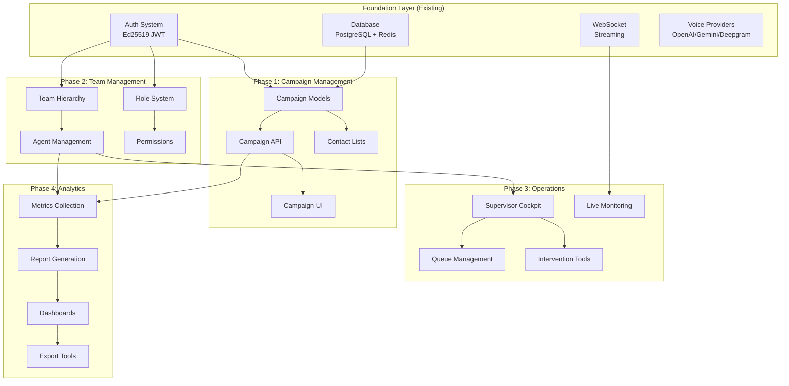

# Feature Dependencies Map - CC-Lite 2026

**Created:** November 10, 2025
**Purpose:** Visual and technical mapping of feature dependencies for phased implementation

---

## 🎯 Core Dependency Chain



---

## 📊 Feature Dependency Matrix

| Feature | Depends On | Required For | Priority | Week |
|---------|------------|--------------|----------|------|
| **Campaign Management** ||||
| Campaign Models | Database | All campaign features | P0 | 1 |
| Campaign API | Models, Auth | Frontend, Operations | P0 | 1 |
| Campaign UI | API, Auth Frontend | User interaction | P0 | 1-2 |
| Contact Lists | Campaign Models | Outbound calling | P0 | 2 |
| Script Templates | Campaign Models | Agent guidance | P1 | 2 |
| **Team Management** ||||
| Team Hierarchy | Auth, Database | Agent assignment | P0 | 3 |
| Agent Management | Team Hierarchy | Operations | P0 | 3 |
| Role System | Auth | Permissions | P0 | 3 |
| Skill Groups | Agent Management | Routing | P1 | 4 |
| **Supervisor Cockpit** ||||
| Queue Management | Team, Campaigns | Call distribution | P0 | 5 |
| Live Monitoring | WebSocket, Sessions | Real-time view | P0 | 5-6 |
| Intervention Tools | WebSocket, Auth | Call control | P0 | 6 |
| Quality Monitoring | Sessions, Analytics | QA features | P1 | 7 |
| **Analytics & Reporting** ||||
| Metrics Collection | All modules | Reporting | P0 | 8 |
| Report Engine | Metrics, Database | Dashboard | P0 | 8-9 |
| Dashboard UI | Report Engine | Visualization | P0 | 9 |
| Export Tools | Reports | Data extraction | P1 | 10 |
| **Multi-Language** ||||
| i18n Framework | Frontend | Localization | P1 | 11 |
| Translation Files | i18n | Language support | P1 | 11 |
| Voice Language | Providers | Multi-lang calls | P1 | 11-12 |

---

## 🔗 Critical Path Dependencies

### 1. Database Schema Evolution
```
Base Schema (existing)
    ├── users table
    ├── sessions table
    └── auth tokens
            ↓
Campaign Schema (Week 1)
    ├── campaigns table
    ├── contacts table
    ├── scripts table
    └── campaign_sessions junction
            ↓
Team Schema (Week 3)
    ├── teams table
    ├── team_members junction
    ├── roles table
    └── permissions table
            ↓
Analytics Schema (Week 8)
    ├── metrics table
    ├── reports table
    └── aggregations table
```

### 2. API Layer Dependencies
```
/api/v1/ (existing)
    ├── /auth/* - Authentication endpoints
    ├── /sessions/* - Session management
    └── /providers/* - Provider status
            ↓
/api/v1/campaigns/* (Week 1-2)
    ├── CRUD operations
    ├── Contact management
    └── Script templates
            ↓
/api/v1/teams/* (Week 3-4)
    ├── Team CRUD
    ├── Agent assignment
    └── Role management
            ↓
/api/v1/supervisor/* (Week 5-7)
    ├── Queue management
    ├── Live monitoring
    └── Intervention
            ↓
/api/v1/analytics/* (Week 8-10)
    ├── Metrics API
    ├── Report generation
    └── Export endpoints
```

### 3. Frontend Component Tree
```
App.svelte (existing)
    ├── AuthLayout
    │   └── Login/Register
    ├── DashboardLayout
    │   ├── Navigation
    │   └── Content Area
    └── WebSocketProvider
            ↓
CampaignManager (Week 1-2)
    ├── CampaignList
    ├── CampaignForm
    ├── ContactManager
    └── ScriptEditor
            ↓
TeamManager (Week 3-4)
    ├── TeamTree
    ├── AgentList
    ├── RoleManager
    └── SkillMatrix
            ↓
SupervisorCockpit (Week 5-7)
    ├── QueueView
    ├── LiveAgentGrid
    ├── CallMonitor
    └── InterventionPanel
            ↓
AnalyticsDashboard (Week 8-10)
    ├── MetricCards
    ├── ChartWidgets
    ├── ReportBuilder
    └── ExportManager
```

---

## 🚦 Implementation Order & Blockers

### Phase 1: Campaign Management (Weeks 1-2)
**No blockers** - Can start immediately
- Database models → API endpoints → Frontend UI
- Parallel work possible on UI while API develops

### Phase 2: Team Management (Weeks 3-4)
**Blocks on:** Campaign completion
- Need campaign context for team assignment
- Requires role-based auth extension

### Phase 3: Supervisor Cockpit (Weeks 5-7)
**Blocks on:** Team Management
- Needs agent hierarchy for monitoring
- Requires live session WebSocket enhancements

### Phase 4: Analytics (Weeks 8-10)
**Blocks on:** Operational features
- Needs data from campaigns and teams
- Requires metrics collection infrastructure

### Phase 5: Multi-Language (Weeks 11-12)
**Blocks on:** Core features complete
- i18n can overlay existing features
- Voice language requires provider updates

---

## 🔄 Integration Points

### Cross-Module Dependencies
```yaml
Campaign ↔ Team:
  - Campaigns assign to teams
  - Teams execute campaigns
  - Agents belong to skill groups

Team ↔ Supervisor:
  - Supervisors manage teams
  - Live monitoring of agents
  - Queue distribution by skills

Campaign ↔ Analytics:
  - Campaign performance metrics
  - Contact conversion tracking
  - Script effectiveness

All → WebSocket:
  - Real-time updates
  - Live monitoring
  - Event notifications
```

### Shared Services
```python
# Core services used by all modules
class SharedServices:
    auth_service: AuthService          # All modules
    database: DatabaseService          # All modules
    websocket: WebSocketManager        # Live features
    cache: RedisCache                  # Performance
    event_bus: EventBus               # Module communication
    metrics: MetricsCollector         # Analytics
```

---

## 🎨 UI Component Dependencies

### Shared Components (Build First)
```typescript
// Week 0-1: Foundation components
DataTable.svelte        // Used by all list views
FormBuilder.svelte      // Used by all forms
Modal.svelte           // Used everywhere
Toast.svelte           // Notifications
LoadingSpinner.svelte  // Loading states
ErrorBoundary.svelte   // Error handling

// Week 2: Advanced components
TreeView.svelte        // Team hierarchy
LiveCard.svelte        // Agent monitoring
Chart.svelte           // Analytics
Dropdown.svelte        // Selections
DatePicker.svelte      // Scheduling
```

### Module-Specific Components
```typescript
// Campaign Module
CampaignCard.svelte    // Depends on: Card, Badge
ContactTable.svelte    // Depends on: DataTable, Checkbox
ScriptEditor.svelte    // Depends on: Monaco/CodeMirror

// Team Module
TeamTree.svelte        // Depends on: TreeView, ContextMenu
AgentCard.svelte       // Depends on: Card, Avatar, Badge
SkillMatrix.svelte     // Depends on: Table, Checkbox

// Supervisor Module
QueueWidget.svelte     // Depends on: LiveCard, Progress
CallMonitor.svelte     // Depends on: WebSocket, Audio
AgentGrid.svelte       // Depends on: Grid, LiveCard

// Analytics Module
MetricCard.svelte      // Depends on: Card, Chart
ReportBuilder.svelte   // Depends on: FormBuilder, Preview
ExportDialog.svelte    // Depends on: Modal, Form
```

---

## 🔌 API Endpoint Dependencies

### Sequential Implementation Required
```http
# 1. Base endpoints (existing)
GET /api/v1/auth/me
POST /api/v1/sessions

# 2. Campaign endpoints (Week 1)
POST /api/v1/campaigns                    # No dependencies
GET /api/v1/campaigns/{id}               # Depends on: Create
PUT /api/v1/campaigns/{id}/contacts      # Depends on: Create
POST /api/v1/campaigns/{id}/activate     # Depends on: Contacts

# 3. Team endpoints (Week 3)
POST /api/v1/teams                       # Depends on: Auth roles
POST /api/v1/teams/{id}/agents          # Depends on: Team create
PUT /api/v1/teams/{id}/campaigns        # Depends on: Campaigns

# 4. Supervisor endpoints (Week 5)
GET /api/v1/supervisor/queue            # Depends on: Teams
GET /api/v1/supervisor/agents/live      # Depends on: Teams, Sessions
POST /api/v1/supervisor/intervene       # Depends on: Live monitoring

# 5. Analytics endpoints (Week 8)
GET /api/v1/analytics/metrics           # Depends on: All operations
POST /api/v1/analytics/reports          # Depends on: Metrics
GET /api/v1/analytics/export            # Depends on: Reports
```

---

## 🧪 Testing Dependencies

### Test Implementation Order
```yaml
Unit Tests:
  1. Models (Week 1)
  2. Services (Week 1)
  3. API endpoints (Week 2)
  4. Frontend components (Week 2)

Integration Tests:
  1. Database operations (Week 3)
  2. API workflows (Week 4)
  3. WebSocket flows (Week 5)
  4. End-to-end scenarios (Week 6)

Performance Tests:
  1. Load testing (Week 10)
  2. Stress testing (Week 11)
  3. Scalability testing (Week 12)
```

---

## 🚀 Parallel Development Opportunities

### Can Be Developed in Parallel
- **Frontend & Backend**: Once API contracts defined
- **Documentation & Code**: Continuous documentation
- **Tests & Features**: TDD approach
- **UI Components**: Independent component library

### Must Be Sequential
- **Database migrations**: Order matters
- **API versioning**: Breaking changes
- **Authentication changes**: Security critical
- **WebSocket protocol**: Client-server sync

---

## 📋 Dependency Checklist

### Before Starting Week 1 (Campaign Management)
- [x] Database connection working
- [x] Auth system functional
- [x] Basic API structure
- [x] Frontend routing setup
- [x] Development environment ready

### Before Starting Week 3 (Team Management)
- [ ] Campaign CRUD complete
- [ ] Contact management working
- [ ] Role system designed
- [ ] Permission model defined

### Before Starting Week 5 (Supervisor)
- [ ] Team hierarchy implemented
- [ ] Agent assignment working
- [ ] WebSocket enhancements ready
- [ ] Live session tracking

### Before Starting Week 8 (Analytics)
- [ ] Metrics collection active
- [ ] Data aggregation pipeline
- [ ] Report templates defined
- [ ] Export formats decided

### Before Starting Week 11 (Multi-language)
- [ ] Core features stable
- [ ] i18n framework chosen
- [ ] Translation workflow defined
- [ ] Voice provider language support verified

---

## 🔴 Critical Risk Dependencies

### High Risk
1. **WebSocket Scaling**: Live monitoring depends on WebSocket performance
2. **Database Performance**: Analytics queries on large datasets
3. **Provider Limits**: API rate limits affect concurrent calls

### Mitigation Strategies
1. **WebSocket**: Implement connection pooling, add Redis pub/sub
2. **Database**: Add indexes early, implement caching layer
3. **Providers**: Implement circuit breaker, add fallback providers

---

**Next Step:** Begin Week 1 implementation following this dependency map